# OAuth 2.0 authentication vulnerabilities

## OAuth là gì?

Trước khi bắt đầu, có bao giờ bạn thắc mắc rằng tại sao [Gitlab](https://gitlab.com) lại cho phép *Sign in* bằng các website/framework khác (Google, Github, Twitter...)?

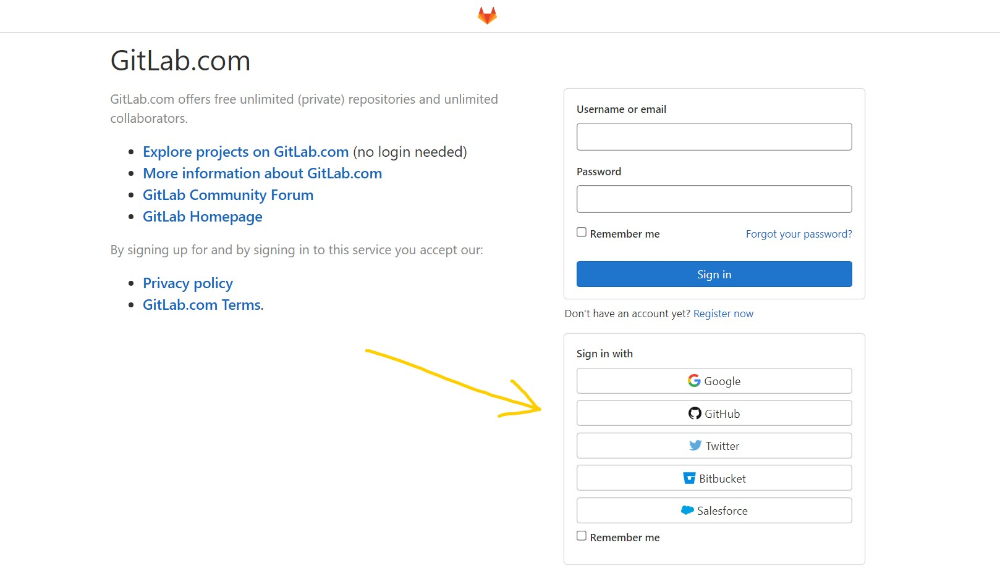

Từ lúc mình biết đến chức năng **quick sign in** này thì mình có thắc mắc như vậy và cái đó chính là OAuth/OAuth2.0 trên các website.

Hiểu đơn giản rằng, OAuth sẽ cho phép một website sử dụng chức năng ủy quyền tài khoản của user với tài khoản ở một website khác. Với OAuth, người dùng có thể tinh chỉnh dữ liệu nào họ muốn chia sẻ thay vì phải giao toàn quyền kiểm soát tài khoản của họ cho bên thứ ba. Cơ chế này rất hay và tiện ích khi người dùng có thể sử dụng một tài khoản và đăng nhập trên nhiều nền tảng khác nhau.

OAuth và OAuth 2.0  là hai phiên bản khác nhau và OAuth 2.0 không được phát triển trên source của OAuth. Theo mình thấy thì nó khá hay ho và hữu ích. Tuy vậy, nó cũng tồn tại các "khe hở" khiến nó có thể bị attacker lợi dụng.

## OAuth 2.0

OAuth 2.0 được phát triển như một cách để chia sẻ kết nối với khối dữ liệu nhất định giữa các ứng dụng với nhau. Nó là trung gian giao tiếp giữa 3 bên bao gồm: chủ sở hữu data (data owner), ứng dụng khách (client application) và nhà cung cấp OAuth (OAuth provider).

### Cách OAuth 2.0 hoạt động
Để OAuth hoạt động thì có nhiều cách khác nhau và chúng thường được biết đến là 2 loại "flows" hoặc "grant types".

Tổng quan mà nói thì nó sẽ hoạt động chủ yếu theo 4 giai đoạn sau
1. Client Application yêu cầu kết nối đến một vùng dữ liệu nào đó của user. Trong yêu cầu đó thì cũng chỉ cụ thể là sẽ sử dụng loại OAuth nào và cách kết nối ra sao.
2. Người dùng đăng nhập vào dịch vụ OAuth sau đó đồng ý các yêu cầu của Client Application
3. Client Application nhận được một **unique access token** để nó chứng minh là nó có quyền kết nối đến data (user cho phép ở trên).
4. Client Application sử dụng token để khiến API nạp dữ liệu liên quan từ server.

### Một vài lỗ hổng với OAuth/OAuth2
Ở phía Client Application:
- Lỗ hổng triển khai không đúng cách xác nhận (grant type) ở client application
- Lỗ hổng CSRF

Ở phía OAuth service:
- Bị leak mã ủy quyền (authorization code) và mã truy cập (access token)
	- Xác thực redirect_uri không đúng luật
	- Bị đánh cắp mã và mã thông báo truy cập qua trang proxy
- Lỗ hổng xác thực phạm vị (scope validation)
- Không kiểm tra việc người dùng đăng ký

Ở phía user:
- Bị leak hoặc tấn công máy tính
- Đăng nhập vào các trang có mã độc

## LAB - Thực hành
Để hiểu rõ hơn về OAuth/OAuth2 thì phải thực hành thôi :3

Truy cập nhanh từng lab tại đây:
- [Lab: Authentication bypass via OAuth implicit flow](#implicit-flow)
- [Lab: Forced OAuth profile linking](#oauth-profile-linking)
- [Lab: OAuth account hijacking via redirect_uri](#OAuth-hijacking)
- [Lab: Stealing OAuth access tokens via an open redirect](#stealing-redirect)
- [Lab: Stealing OAuth access tokens via a proxy page](#stealing-proxy)

### Lab: Authentication bypass via OAuth implicit 

Đường dẫn đến lab [ở đây](https://portswigger.net/web-security/oauth/lab-oauth-authentication-bypass-via-oauth-implicit-flow)

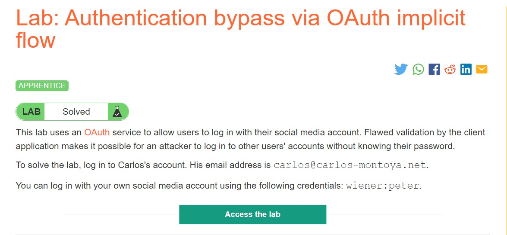

Đối với *Implicit grant type*, đây là một cách xác thực kiểu ngầm hiểu và nhanh chóng. Chính vì nó nhanh nên dễ có lỗi. Tổng quan qua thì flow của nó như sau:
1. Authorization request - Xác thực yêu cầu: Khi người dùng yêu cầu login bằng OAuth, nó website sẽ request đến OAuth Service
2. User consent - Người dùng chấp thuận: Người dùng sẽ click để đồng ý với request login bằng OAuth
3. Access token grant - Cấp mã token để truy cập: Sau khi user đồng ý request, OAuth Service sẽ chuyển hướng đến trình duyệt của user. Nhưng thay vì nó gửi theo một mã xác thực thì "implicit grant type" nó gửi luôn cái token thông qua request. Sau đó, Client Application phải lấy thông tin đó và cấp truy cập
4. API call - Gọi API: Sau khi có được access token, Client Application gọi một API đến OAuth Service thông qua trình duyệt để request thông tin người dung */userinfo*
5. Resource grant - Cấp quyền truy cập tài nguyên: Server sẽ xác thực token đối với Client Application đang ở phiên đó. Nếu đúng thì nó sẽ phản hồi bằng cách request tài nguyên dữ liệu của user dựa trên token và Client Application có thể sử dụng thông tin, data đó của user.

Bài lab này yêu cầu ta thực hiện login với tài khoản social media và cố gắng truy cập vào bằng tài khoản email *carlos@carlos-montoya.net*

Lab đã cung cấp sẵn tài khoản của chú Wiener rồi và chúng ta sẽ truy cập thử vào tài khoản này rồi sử dụng Burp Suite để kiểm tra HTTP Proxy xem điều gì xảy ra nhé!

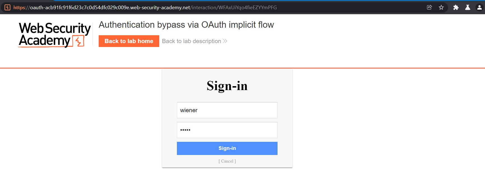

Sau khi login vào tài khoản của chú Wiener, mình kiểm tra HTTP Proxy thì nó ghi lại log như sau:

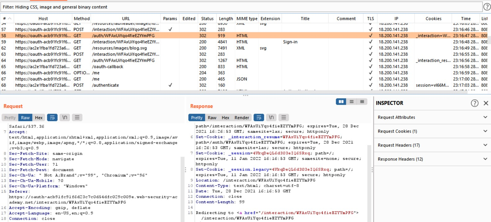

Ở request thứ 58, xuất hiện request đến OAuth Service */auth/...* để xác thực thông tin user đến (host của nó là oauth-acb....)

Check xuống thì ta có thể thấy ở request 68, server đang thực hiện phản hồi bằng cách POST */authenticate* đến host Client Service để thông báo là "à token đó đúng rồi đó, bạn có thể truy cập tài nguyên của user rồi đó"

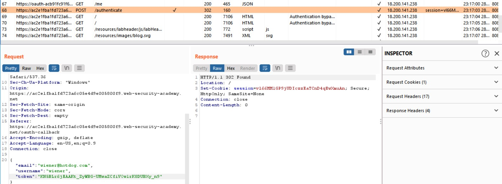

Okay, đến đây thì mình đã có access token, một cái mã để truy cập cho phiên làm việc. Vậy thì mình sẽ dựa vào cái này để đánh lừa server là ông chú Carlos đang truy cập với email của ổng. Vì với "implicit grant type" không có bước nào nó xác thực lại thông tin request của bên OAuth cả mà nó theo 1 flow qua lại sau khi user đã đồng ý login bằng OAuth.

Ta thực hiện đổi "email" của chú Wiener thành của chú Carlos và POST request lên server:

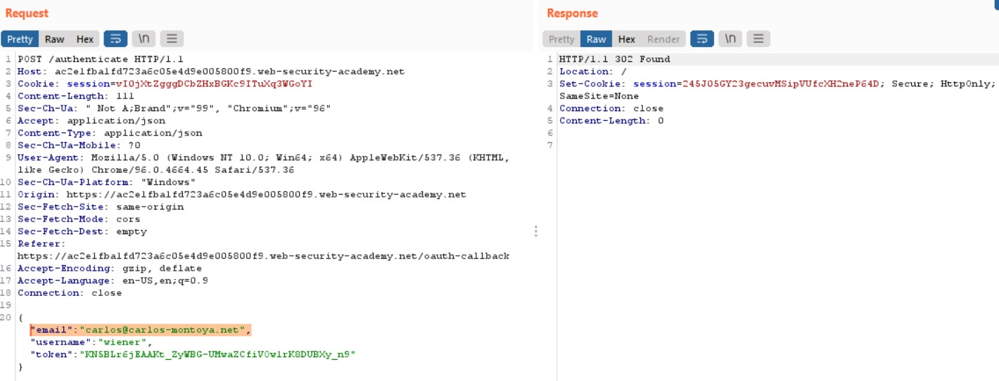

Cuối cùng, ta thực hiện reload lại trình duyệt và kiểm tra thì đã solved được lab cũng như truy cập thành công tài khoản của chú Carlos yêu dấu.

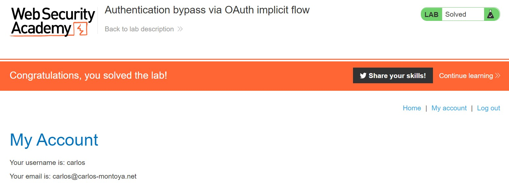

Note: Nếu reload mà không thấy được solve thì bạn có thể sử dụng chức năng [*Request to browser*](OAuth-implicit-flow/note.jpg) để chọn phiên làm việc của cái request POST đã sửa email nhé!

### Lab: Forced OAuth profile linking 

Đường dẫn đến lab [ở đây](https://portswigger.net/web-security/oauth/lab-oauth-forced-oauth-profile-linking)

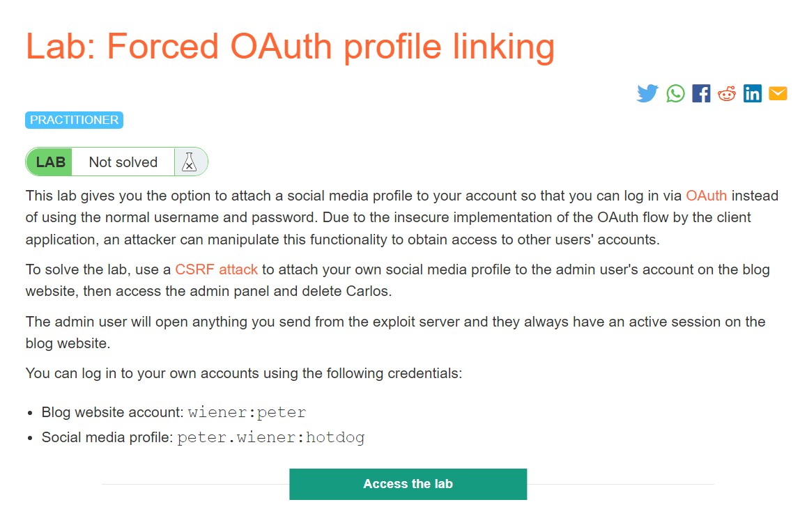

Trong bài này, mình sẽ cần login vào tài khoản bằng OAuth thay vì là tài khoản và mật khẩu thông thường. Lab cũng nói là sử dụng CSRF để khai thác.

Tương tự như các bài lab, ta thử login bằng tài khoản được cung cấp, sau đó link với OAuth

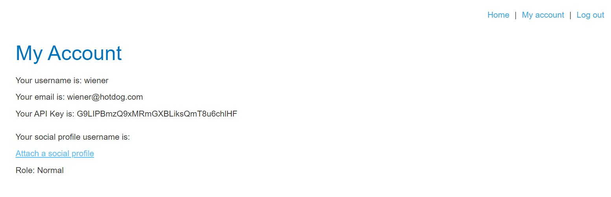

Sau đó, sử dụng tài khoản *peter.wiener:hotdog* để link với social account

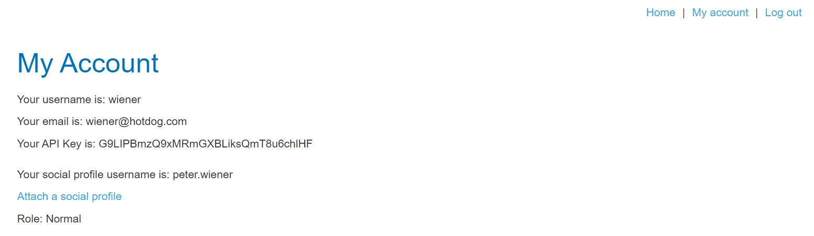

Đến đây, ta sẽ phân tích Proxy History xem những gì đã xảy ra. Mình phát hiện được request thứ 53 là một request để link tài khoản social với tài khoản dạng */auth...*

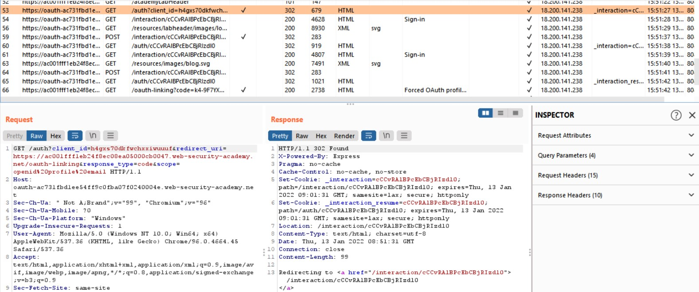

Như lab đã đề cập, bài này sẽ liên quan đến CSRF, do vậy, khi xem kỹ request này thì tham số *state* không được sử dụng.

Tham số *state* là một tham số có nhiệm vụ mã hóa thông tin mà bạn cần. Sau đó, bạn sẽ sử dụng một giá trị random đó để xác thực lúc nhận được phản hồi. Tham số này rất quan trọng để tránh CSRF attack nhưng trong request trên thì người ta lại không dùng. Đến đây thì mình sẽ lợi dụng tính thiếu xác thực này để khai thác nó.

Trong proxy history, ở request thứ 66, ta có thể thấy được 1 request dạng */oauth-linking=?code...*. Request này có vẻ như yêu cầu xác thực với code để hoàn tất quá trình login bằng OAuth. Và với vai trò như vậy thì có nghĩa code này sẽ chỉ được sử dụng 1 lần. Dựa vào đây mình có thể nhờ nó để có thể đánh lừa server bằng cách trộm nó nhưng không sử dụng nó, có nghĩa là nó vẫn còn hiệu lực và mình có thể khai thác bằng cách đánh lừa *exploit server* mà lab đã cung cấp để login as admin.

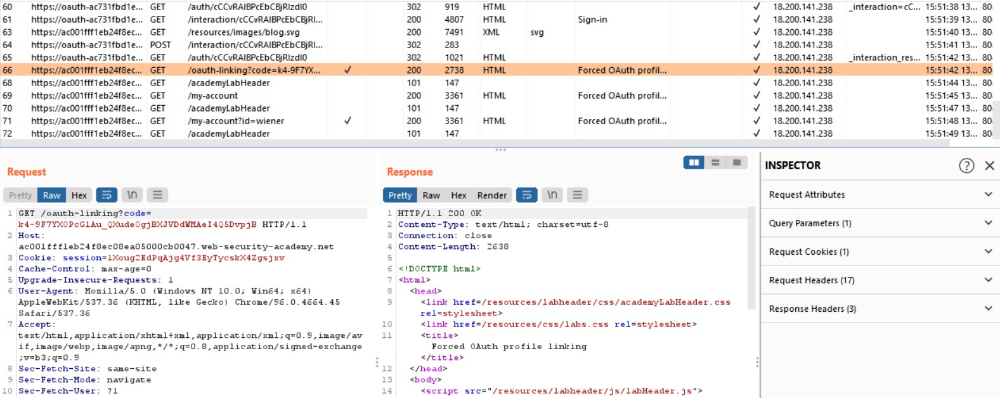

Okay, đến đây ta thực hiện login lại từ đầu và link với social account 1 lần nữa, nhưng đến bước *Continue* sau khi link với social account thì ta sẽ drop nó để hủy request (có nghĩa là đợi server gửi code cho mình xong mình sẽ qua cầu rút ván =)))).

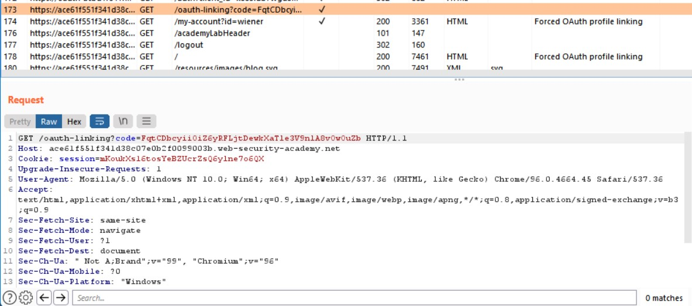

Đây là code mà mình đã trộm được. Bây giờ, mình sẽ vào exploit server để khai thác. Bởi vì server sẽ đọc tất cả những gì mà mình gửi do vậy, mình sẽ gửi đi 1 iframe để đánh lừa hệ thống với code mình trộm được ban nãy. Mình sẽ copy nguyên cái request chứa mã xác thực nãy chưa dùng và gắn nó vào src:

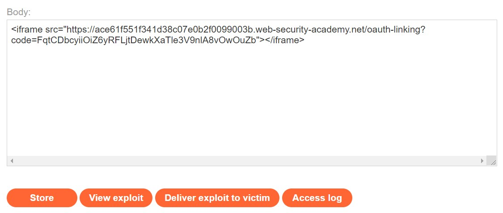

Sau đó, mình send nó và reload lại page và click vào Admin Panel thì mình sẽ thấy được 2 nút delete quyền lực:

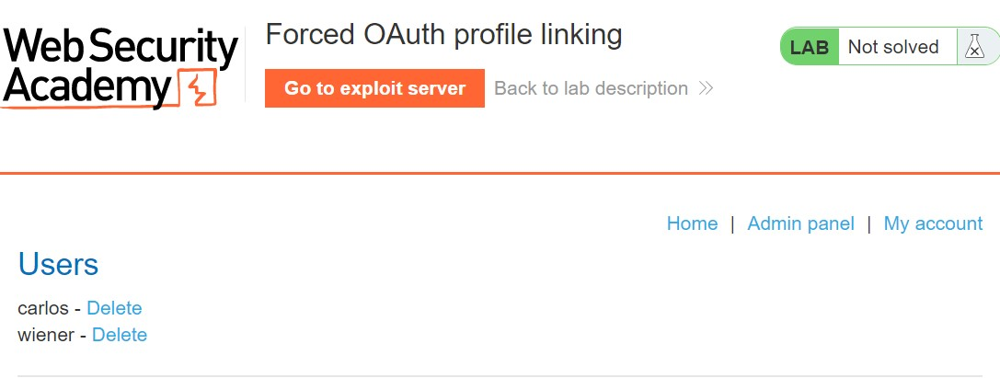

Đến đây thì bai bai chú Carlos và thế là solved!

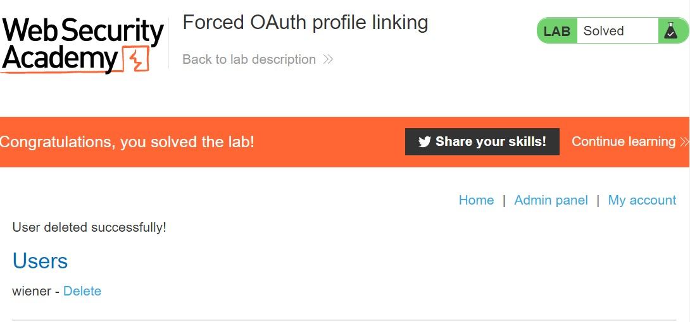

Tóm lại, OAuth sẽ có nhiều option để thiết lập, do vậy, khi thiếu state khi trao đổi thông tin từ server và client thì sẽ là một mối nguy hiểm liên quan đến lỗ hổng CSRF.

### Lab: OAuth account hijacking via redirect_uri 

Đường dẫn đến lab [ở đây](https://portswigger.net/web-security/oauth/lab-oauth-account-hijacking-via-redirect-uri)

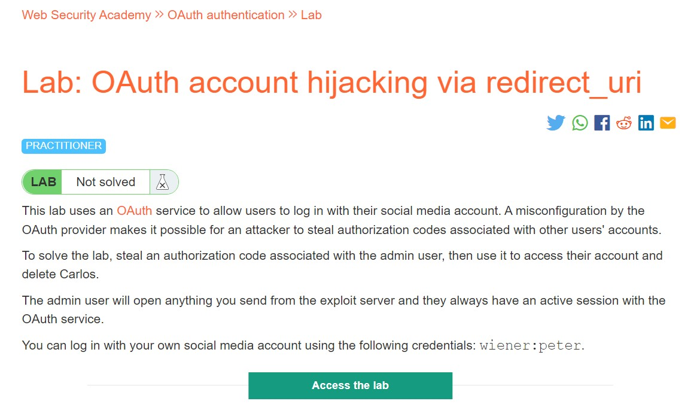

Đầu tiên, mình sẽ "go around" website với quy trình login. Mở Burp check History Proxy, ta có thể thấy được request yêu cầu xác thực **/auth?client_id=...**:

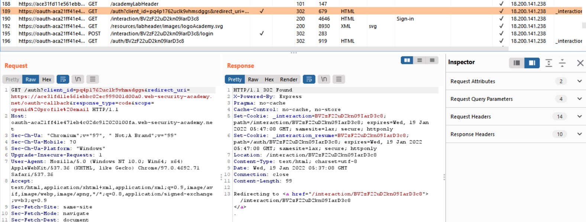

Sau đó, ta send nó sang Burp Repeater để tiện theo dõi quá trình "login" của nó. Ở đây, với tham số **redirect_uri**, ta có thể thử điều chỉnh nó đến exploit server để xem có gì xảy ra:

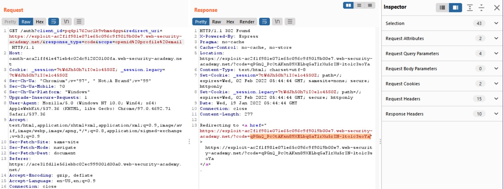

Sau khi send request, ta tiếp tục Follow Redirect thì nhận được một redirect url với một dòng code như bên trên. Như vậy, có thể thấy với tham số redirect-uri mà không kiểm tra thì ra có thể dễ dàng redirect đến bất cứ đâu ta muốn như trong trường hợp này thì đã lừa được server gọi callback send code về cho ta.

Tương tự, ta sẽ sử dụng Exploit Server để tiến hành exploit challenge. Mình sẽ send một request đến **/exploit** với body là một iframe:

Sau khi Store và Deliver Code đến nạn nhân, kiểm tra Access log thì ta có được một request với leak-code:

Sử dụng browser để truy cập đến URL đó, ta sẽ vào được Admin Panel:

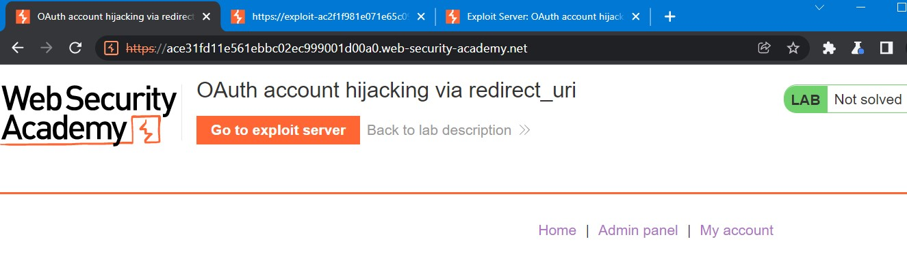

Và thế là ta đã vào được Admin Panel, tiến hành xóa chú Carlos thì đã giải được challenge:

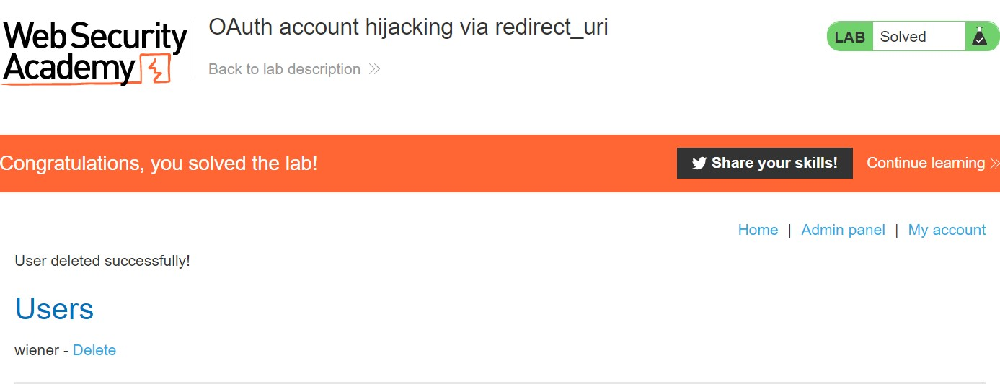

### Lab: Stealing OAuth access tokens via an open redirect 

Đường dẫn đến lab [ở đây](https://portswigger.net/web-security/oauth/lab-OAuth-stealing-redirect-oauth-access-tokens-via-an-open-redirect)

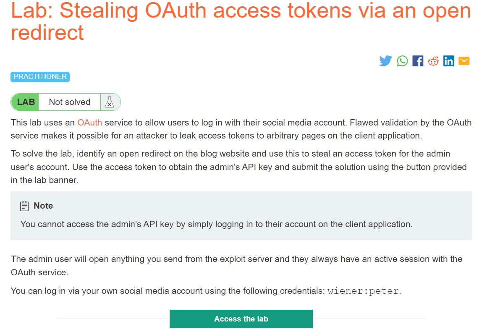

Thử thay đổi URI như các phần bên trên thì kết quả cho thấy, server không chiều theo ý ta nữa rồi. Ở lab này, tác giả có đề cập đến 1 phương pháp đó chính là Path Traversal và ta sẽ sử dụng chúng.

Ở server exploit, ta sẽ thử send đên server đoạn payload như dưới đây để buộc server gửi về cho ta access token:

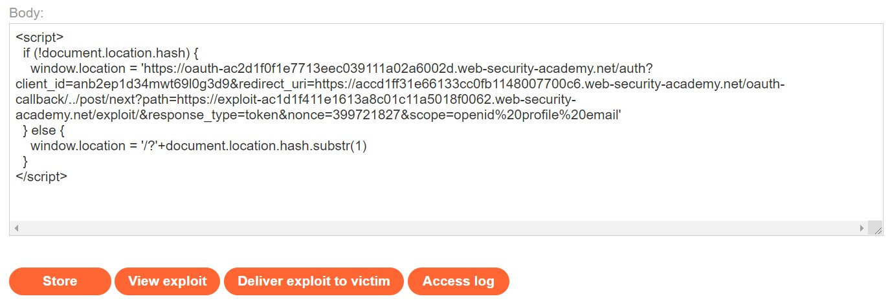

Sau khi Store, ta sử dụng View Exploit xem payload đã gửi chưa:

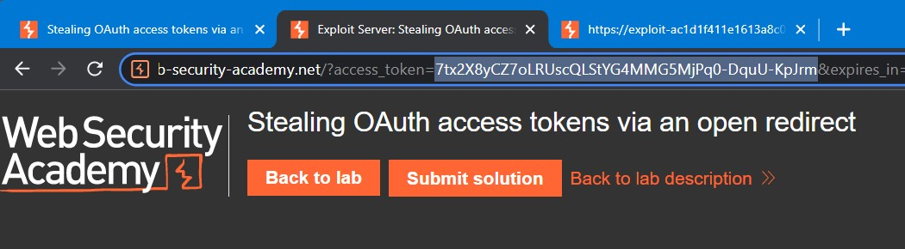

Như ta thấy, một access token đã được đính kèm trên URL như vậy có nghĩa là token này đã bị leaked khi ta sử dụng payload.

Quay lại Proxy History, ta thấy với request **/me**, server sẽ trả về cho ta một cái gọi là apikey. Để trả về đúng API key, server sẽ xác thực với **Authorization** cùng token:

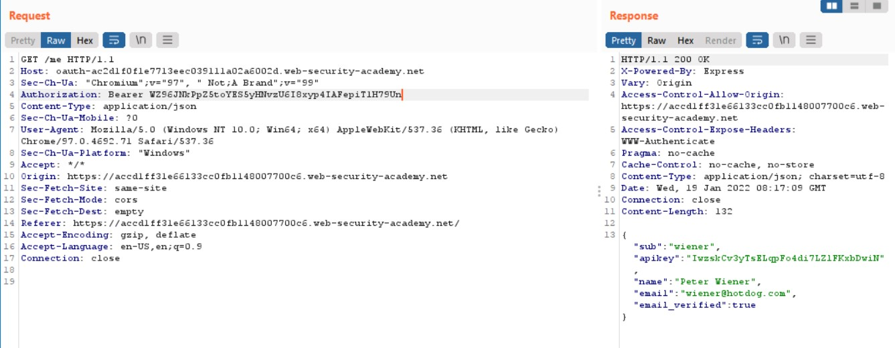

Ta sẽ Delivery code exploit với payload ở trên để leak 1 token mới. Kiểm tra log sẽ thấy token như sau:

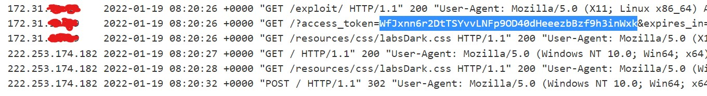

Đến lúc này ta thay đổi token và send nó thì sẽ nhận được API key cần tìm của administrator:

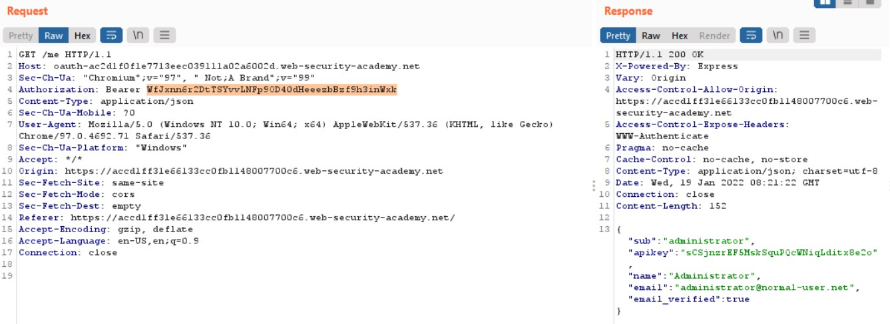

Và lúc này chỉ cần submit challenge thôi:

### Lab: Stealing OAuth access tokens via a proxy page 

Đường dẫn đến lab [ở đây](https://portswigger.net/web-security/oauth/lab-oauth-stealing-oauth-access-tokens-via-a-proxy-page)

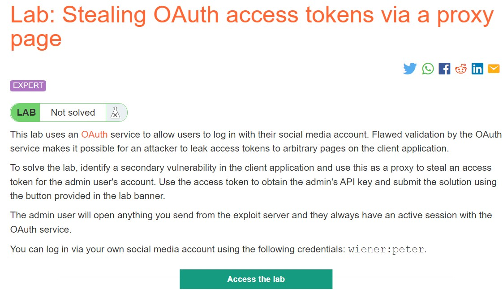

Bài này cũng khá giống với bài bên trên, audit website thì ta có thể thấy ở mỗi post đều có chức năng bình luận và bình luận cái gì cũng được:

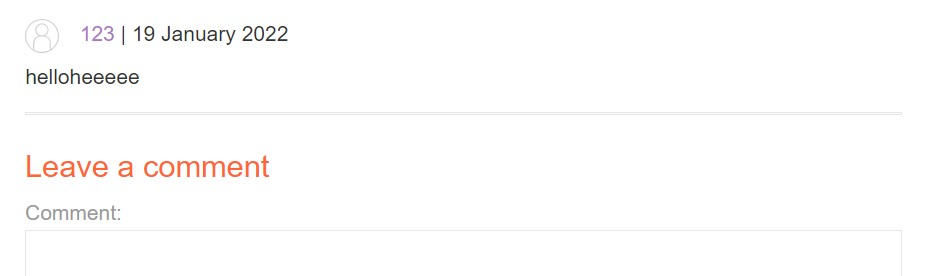

Đến đây, sau khi tham khảo payload, mình đã thử sử dụng payload như sau:

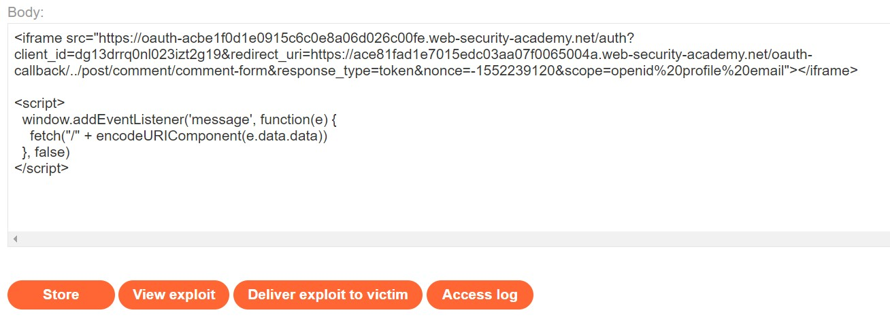

Store và View Exploit thì thấy ta đã có một iframe comment như lab:

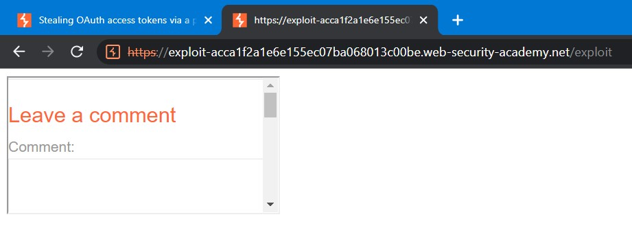

Đến đây coi như xong, ta Delivery exploit code sau đó check log để get token:

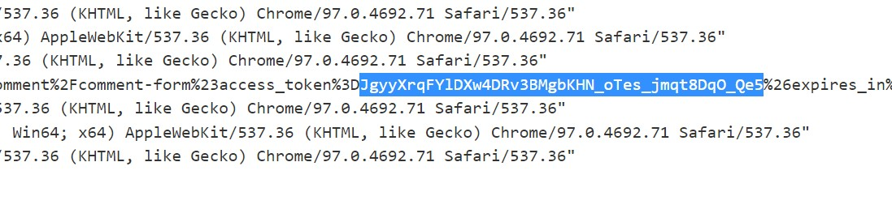

Send token bằng request **/me**:

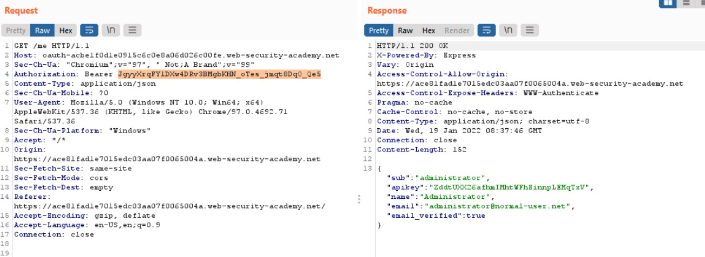

Như vậy, ta đã có được API của administrator, submit thôi:

## Vậy làm thế nào để ngăn chặn OAuth authentication vuln?

*Từ phía nhà cung cấp*:
- Tạo whitelist cho **redirect_uris** để xác thực các request dẫn đến redirect website
- Sử dụng tham số **state** tạo giá trị ngẫu nhiên để xác thực
- Server cần xác thực các phiên và client_id

*Từ phía client application*:
- Cần hiểu rõ cácg OAuth hoạt động để tránh các lỗi thường gặp
- Sử dụng **state** dù hoàn cảnh nào
- Gửi redirect_uri đến /authentication và cả /token endpoint
- Và nhiều cách khác phù hợp theo từng hoàn cảnh sử dụng