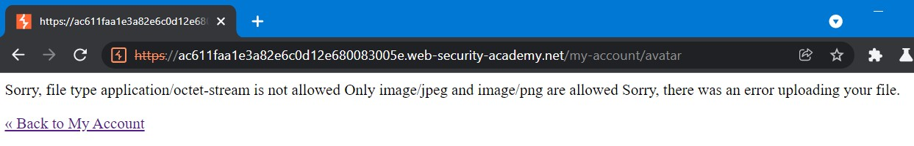

# File upload vulnerabilities

## Lỗ hổng file upload
Lỗ hổng file upload là một loại lỗ hổng có mức độ nghiêm trọng cao. Nó được xảy ra khi một web server cho phép người dùng đăng tải một tệp lên filesystems mà không qua những bước xác thực (tên, loại tệp, nội dung, kích thước,...) hoặc hệ thống bị lỗi khi xác thực.

Khi đó, attacker có thể lợi dụng lỗ hổng này để tấn công hệ thống bằng các phương pháp khác nhau, đặc biệt là là RCE (remote code execution), khiến hệ thống của bạn vào trạng thái nguy hiểm.

Hai tác động chính của lỗ hổng này bao gồm:
- Hệ thống xác thực sai cách và bỏ qua những xác thực quan trọng
- Những ràng buộc được thiết lập thực thi khi tệp đã tải lên hệ thống

Bên cạnh đó, một trong những trường hợp xấu nhất có thể xảy ra đó là hệ thống cho phép thực thi các tệp "có thể thực thi" (như .php hoặc .jsp). Điều này vô tình cho phép attacker tải lên các đoạn code như webshell và kiểm soát hoàn toàn hệ thống của mình.

## Các trường hợp có thể xảy ra
Trong thực tế, các công ty, tổ chức thường kiểm soát rất tốt lỗ hổng này và tự tin vào khả năng xác thực hệ thống của họ. Tuy vậy, khi triển khai 'block' nó thì vẫn có thể tồn tại những trường hợp có thể khiến hệ thống của bạn mắc lỗi này:
- Đơn giản nhất, bạn quên xác thực các loại tệp, nội dung, kích thước,.... của tệp được tải lên
- Bạn tạo blacklist để chặn các loại tệp nguy hiểm nhưng không xác thực những loại **extensions lạ** (ví dụ: .nh4ttruong, .heheattacker,...)
- Web server của bạn an toàn nhưng **không nhất quán** khiến attacker có thể sử dụng để **'path traversal'**
- Hệ thống của bạn bị 'thọt' dẫn đến bị bypass dễ dàng bằng các thủ thuật của attacker

## LAB - Thực hành

Sau đây sẽ là phần thực hành khai thác các lỗ hổng liên quan đến File upload vulnerabilities

Xem nhanh các phần:
- [Lab: Remote code execution via web shell upload](#RCE)
- [Lab: Web shell upload via Content-Type restriction bypass](#content-type)
- [Lab: Web shell upload via path traversal](#path-traversal)
- [Lab: Web shell upload via extension blacklist bypass](#extension-blacklist)
- [Lab: Web shell upload via obfuscated file extension](#obfuscated)
- [Lab: Remote code execution via polyglot web shell upload](#polygot)
- [Lab: Web shell upload via race condition](#race-condition)

Let's started!

### [Lab: Remote code execution via web shell upload](https://portswigger.net/web-security/file-upload/lab-file-upload-remote-code-execution-via-web-shell-upload)<a name="RCE"></a>


Bài lab này yêu cầu mình tải lên một đoạn code RCE để có thể kiểm soát web server hay khai thác tải lên tệp không hạn chế để triển khai web shell

Đầu tiên, bật Burp Suite và sử dụng browser của ứng dụng để truy cập vào Lab và thực hiện login bằng tài khoản đã được cung cấp. Vì đây là bài lab liên quan đến upload file nên mình sẽ mò qua phần *My Account* để sử dụng chức năng tải Avatar lên hệ thống.


Sau khi tải thử cái ảnh xàm xí lên hệ thống thì mình nhận được cái thông báo như vầy


Đến đây thì chưa có bất kỳ "clue" nào để mình tiếp tục cả, mò qua HTTP History của chức năng Proxy trong Burp Suite thì ta có thể thấy được các URL mà hệ thống đã thực thi


Như vậy, ta có thể thấy được hệ thống cho phép ta tải lên hình ảnh. Hình ảnh này sẽ được lưu trữ tại `/files/avatars/{tên-tệp}`

Theo như đề bài, *secret* được cất giữ tại `/home/carlos/secret` và web server sử dụng ngôn ngữ PHP. Do đó, mình sẽ sử dụng một RCE payload code để có thể "reveal" bí mật của chú Carlos và lưu lại với cái tên mỹ miều là *1.php* =)))
```php
<?php echo file_get_contents('/home/carlos/secret'); ?>
```

Sau đó, ta tiến hành tải tệp này lên hệ thống: 


Và cũng nhận được thông báo là tệp chứa RCE đã tải lên thành công:


Thử truy cập vào nơi cất giữ các hình ảnh avatar của hệ thống thì ta được hệ thống trả về một string có vẻ như là bí mật của chú Carlos:


Submit bài lab với string vừa tiềm được thì ta đã thành công thực hiện upload một RCE code lên hệ thống PHP khi web server không xác thực "loại tệp" mà người dùng tải lên hệ thống:


### [Lab: Web shell upload via Content-Type restriction bypass](https://portswigger.net/web-security/file-upload/lab-file-upload-web-shell-upload-via-content-type-restriction-bypass)<a name="content-type"></a>
Với website, khi ta gửi một HTML form lên hệ thống, trình duyệt sẽ gửi đi một yêu cầu POST trong đó chức các thông tin của yêu cầu đó. Thông thường, các trình duyệt gửi đi các yêu cầu với thuộc tính Content-Type là `application/x-www-form-url-encoded`.

Đối với các hệ thống khác nhau, Content-Type được sử dụng các giá trị khác nhau để phù hợp nhất. Bài lab này sẽ yêu cầu ta thực hiện khai thác đánh lừa hệ thống để gửi lên web server một RCE code.


Tương tự như bài lab ở trên, ta thực hiện login vào hệ thống và thử "test" hệ thống bằng cách tải lên tệp *1.php* mà mình đã sử dụng ở lab trước thì nhận được thông báo:



Như vậy, hệ thống không cho phép ta tải lên các thể loại tệp thuộc về **application/octet-stream** mà chỉ cho tải lên tệp loại **image/jpeg** hoặc **image/png**

Đến đây, ta sử dụng Burp Repeater để thử đổi Content-Type sang yêu cầu của Lab và gửi lên web server. Mình sẽ sử dụng request bị dính lỗi khi thử upload *1.php* lên hệ thống và đổi lại Content-Type thôi:


Ta thấy, file *1.php* đã được tải lên hệ thống. Bây giờ, ta cần GET tệp này bằng path như ở lab bên trên:


Đến đây, ta đã có được secret của chủ Carlos thân yêu và submit thôi:


Kết quả là chúng ta đã thực hiện khai thác lỗ hổng file upload bằng cách đánh lừa hệ thống khi nó quên xác thực Content-Type của tệp:


### [Lab: Web shell upload via path traversal](https://portswigger.net/web-security/file-upload/lab-file-upload-web-shell-upload-via-path-traversal)<a name="path-traversal"></a>
Một trong những cách các website đối phó với lỗ hổng upload file đó chính là chỉ cho phép server thực thi các tệp được cho phép. Nếu các extension của file không nằm trong cấu hình của server, server có thể trả về các thông báo lỗi hoặc nội dung với **Content-Type: text/plain**.

Điều này vô hình chung có thể dẫn đến attacker lợi dụng để soi source code từ server hoặc các tệp riêng tư của server.

Trong bài lab này, tác giả yêu cầu ta thực hiện upload một RCE code lên server và lợi dụng path traversal để có thể leak được secret của chú Carlos


Tương tự các phần bên trên, trước tiên, ta thử upload đoạn payload của tệp 1.php lên hệ thống:


Ta có thể thấy, server cho phép ta tải tệp lên dù cho nó là .php (có thể thực thi). Nhưng ở lab này, các file này không thể thực thi trong folder của user (một cách ngăn chặn khai thác lỗ hổng upload file) và server trả về nội dung của file ta upload dưới dạng **Content-Type: text/plain** như nãy mình có đề cập.

Từ đó, ta có thể sử dụng kỹ thuật *directory traversal* để kiểm tra xem các folder khác (folder con hoặc folder cha) có cho phép thực thi hay không (thường thì server sẽ block user thôi hehe). Ở đây, mình sẽ sửa đổi request POST ban nãy mình upload file 1.php lên ở chỗ Content-Disposition từ `filename="1.php"` thành `filename="../1.php"`:


Ohno, có vẻ như không thể upload ra một folder khác bằng cách sử dụng `../`. Ta thử một cách khác đó chính là sử dụng URL encoding đổi `"../"` thành `"..%2f"`:


Như vậy, ta đã upload thành công file 1.php lên một thư mục khác với folder của user. Dùng Burp Suite để request đến `/files/avatars/1.php` để xem bí mật của chú Carlos thôi:


Và submit để hoàn thành bài lab này


### [Lab: Web shell upload via extension blacklist bypass](https://portswigger.net/web-security/file-upload/lab-file-upload-web-shell-upload-via-extension-blacklist-bypass)<a name="extension-blacklist"></a>
Trong các phần trên, mình đã có đề cập đến việc sử dụng blacklist để block các loại tệp nguy hiểm. Tuy vậy, các web server vẫn có thể mắc phải các lỗi như cấu hình thiếu chặt chẽ, quản lý file hời hợt khiến attacker có thể dễ dàng "ghi đè" lên tệp cấu hình của server hoặc bypass được blacklist.

Với Apache, server có thể thực thi một tệp PHP theo request và ông dev ổng có thể thêm những cấu hình như cho phép load module nào hoặc thêm các file extension nào lên tệp config (apache2.conf). Bên cạnh đó, nhiều server còn cho phép ông dev upload ghi đè tệp hoặc thêm content vào tệp config. Ví dụ như trong Apache server, nó cho phép load lên một tệp cấu hình cụ thể cho server nếu như trên apache server tồn tại tệp `.htaccess`. Nói vậy thôi, thực tế thì trước khi ta có thể upload một webshell lên hệ thống thì phải trải qua 7749 bước ngăn chặn của server nữa =))))

Trong bài lab này, tác giả yêu cầu ta thực hiện bypass 1 trong 7749 cách ngăn chặn file upload vuln và đó chính là bypass blacklist


Đầu tiên, mình sẽ thử POST file 1.php lên server:


Kết quả trả về Burp Suite cho thấy, server sử dụng Apache2 và file của mình không lên upload lên vì server chặn tệp .php. Như mình có đề cập, các dev có thể linh hoạt thêm vào tệp config (đối với Apache server) các loại tệp sẽ được "cho phép" thực thi trên server. Trong `htaccess`, mấy ông dev chỉ cần thêm dòng `AddType application/x-httpd-php {.extension_cần_thêm}`, server sẽ tự override nó vào `/etc/apache2/apache2.conf`. Lợi dụng điều này, ta sẽ sử dụng Burp Repeater để gửi đi 1 POST mới và gắn cái dòng AddType ở bên trên vào filename .htaccess:


Ta đã thành công gửi file .htaccess lên server. Trong request đó, bạn có thể thấy mình đã gửi request POST và thêm extension mới là .nh4ttruong vào .htaccess (tệp config). Bây giờ, ta thử POST 1 request mới lên server với extension mới:


Thành công rồi hehe, file đã lên được server, việc của ta bậy giờ là GET lại file đó thể thực thi nó:


Và submit bí mật của chú ấy thôi:


### [Lab: Web shell upload via obfuscated file extension](https://portswigger.net/web-security/file-upload/lab-file-upload-web-shell-upload-via-obfuscated-file-extension)<a name="obfuscated"></a>
Ở bài lab này, tác giả sẽ yêu cầu ta bypass blacklist các extension của file.

Thử upload 1.php như các lab khác lên server:


Thông báo trả về là ta chỉ có thể upload các extension về hình ảnh (JPG/PNG). Một trong 7749 cách bypass blacklist tiếp theo mình có thể sử dụng đó chính là bypass extension của file với việc sử dụng các trường hợp **case sensitive** để đánh lừa bộ xác thực của website.

Ký tự `NULL` hay `%00` là một trong những ký tự đặc biệt sẽ có thể khiến bộ xác thực hiểu rằng sau nó không còn gì cả và ta thử bằng cách chèn nó vào như sau:


Như đã thấy, file 1.php đã upload thành công lên server. Và tương tự như các lab trên, GET bí mật và submit thôi


### [Lab: Remote code execution via polyglot web shell upload](https://portswigger.net/web-security/file-upload/lab-file-upload-remote-code-execution-via-polyglot-web-shell-upload)<a name="polygot"></a>
Để tăng mức độ bảo mật cho hệ thống, các server thay vì xác thức Content-Type thì nó sẽ xác thực nội dung của file. Ví dụ, các file hình ảnh JPEG luôn bắt đầu bằng chuỗi bytes `FF D8 FF`.

Bài lab này sẽ thử thách ta bypass mà không thể thay đổi extension của file:


Thử upload 1.php lên server và kết quả trả về:


Ta có thể tải bất kỳ tệp nào lên server nhưng phải thỏa mãn nó là hình ảnh (PNG/JPG) vì nó là avatar mà. Server sẽ xác thực signature của file như ví dụ mình nêu trên. Do đó, ta sẽ sử dụng trick để "ép" 1 file chừa RCE code thành 1 file thỏa điều kiện của server.

[exiftool](https://github.com/exiftool/exiftool) là một trong những công cụ tối ưu hỗ trợ việc thay đổi metadata của file. Ta sẽ sử dụng nó để thay đổi "dấu hiệu" trong file để làm server nghĩ rằng đó là một file hình ảnh và ta sẽ thêm `-Comment="<?php echo 'START ' . file_get_contents('/home/carlos/secret') . ' END'; ?>"` vào file exploit.php mà exiftool sẽ tạo ra:


Upload [exploit.php](obfuscated-extensions/exploit.php) lên server:


Server không chặn việc ta tải lên nữa rồi =)))). GET bí mật bằng cách cho nó thực thi thôi:


Và submit bí mật:


### [Lab: Web shell upload via race condition](https://portswigger.net/web-security/file-upload/lab-file-upload-web-shell-upload-via-race-condition)<a name="race-condition"></a>
Race conditions trong khai thác lỗ hổng file upload là trường hợp xảy ra cho phép bạn có thể upload một file thông qua URL. Server sẽ fetch file của bạn và tạo một bản copy cục bộ trước khi nó bị xác thực.

Ngày nay, các hệ thống càng ngày càng thay đổi để có thể ngăn chặn các cuộc tấn công file upload. Họ sử dụng một nơi lưu trữ tạm thời để lưu trữ tệp, sau đó thay đổi tên ngẫu nhiên tên của tệp và bắt đầu xác thực nó. Tệp nào độc hại thì loại bỏ tệp nào ổn thì sẽ cho phép upload vào nơi lưu trữ gốc. Điều này dường như bất khả thi để dò ra nó tên gì để attacker thực thi nó nếu may mắn vượt qua vòng xác thực.

Bài lab này cũng sẽ mô phỏng hình thức hoạt động trên:


Vỏ quýt dày có móng tay nhọn. Đó là câu mà ông cha ta đã dạy, để bypass cái cách này, ta có thể sử dụng trick để khiến cho quá trình chuyển đổi giữa các bước bị delay để RCE code có thể thực thi trên server.

Ta thực hiện các bước tương tự như các lab ở trên thì thấy hệ thống không cho phép ta upload 1.php lên:


Thử đổi file thành `hehe.php.png` và upload lên hệ thống thì có hệ thống đã cho phép tải RCE code lên nhưng dưới extension PNG :3


Sau đó, sử dụng tiện ích [Turbo Intruder](https://portswigger.net/bappstore/9abaa233088242e8be252cd4ff534988) trong Burp Store để có thể intruder theo ý ta muốn.

Trong HTTP History, ta tìm kiếm request mà đã upload thành công hehe.php.png, sau đó chuột phải -> Extensions -> Turbo Intruders -> Send to Turbo Intruder:


Tiếp theo, ta sử dụng [đoạn code dưới đây](race-condition/turbo-sample.py) và thay đổi <YOUR-POST-REQUEST> thành request POST đã gửi thành công file hehe.php.png, thay đổi <YOUR-GET-REQUEST> thành request đến `/files/avatars/hehe.php.png`. Đại loại thì đoạn code này sẽ giúp cho request của ta được tồn tại lâu hơn và tệp hehe.php (sau khi bỏ .png ở các request thay đổi) có thể thực thi trên server:
```python
def queueRequests(target, wordlists):
    engine = RequestEngine(endpoint=target.endpoint, concurrentConnections=10,)

    request1 = '''<YOUR-POST-REQUEST>'''

    request2 = '''<YOUR-GET-REQUEST>'''

    # the 'gate' argument blocks the final byte of each request until openGate is invoked
    engine.queue(request1, gate='race1')
    for x in range(5):
        engine.queue(request2, gate='race1')

    # wait until every 'race1' tagged request is ready
    # then send the final byte of each request
    # (this method is non-blocking, just like queue)
    engine.openGate('race1')

    engine.complete(timeout=60)

def handleResponse(req, interesting):
    table.add(req)
```

Lưu ý, khi đổi xong 2 phần trên, ta cần phải loại bỏ phần `.png` để có biến nó thành `.php` để nó có thể thực thi trên hệ thống.

Bây giờ, ta đã config xong xuôi thì bấm Attack và chờ đợi timeout 60s:


Ở các request, ta có thể tìm kiếm được bí mật của chú Carlos và submit thôi:


## Note
    
### Các cách tấn công khác
Ngoài sử dụng RCE code, file upload còn có thể bị tấn công bằng các thủ thuật như:
- Tải mã độc bằng ở client-side: Như các lỗ hổng store XSS
- Khai thác lỗ hổng trong việc phân tích cú pháp của tệp: Như XEE Injection attacks
- Sử dụng method PUT để upload file

### Một vài cách ngăn chặn
- Sử dụng whitelist thay vì blacklist
- Đảm bảo filename không chứa chuỗi con để server có thể hiểu được đó là một tệp hoặc một chuỗi (tránh path traversal)
- Đổi tên tệp đã tải lên để tránh đụng độ có thể khiến tệp hiện có bị ghi đè
- Không cho phép file tải lên mà không qua bước xác thực, sau đó, chuyển qua nơi lưu trữ chính
