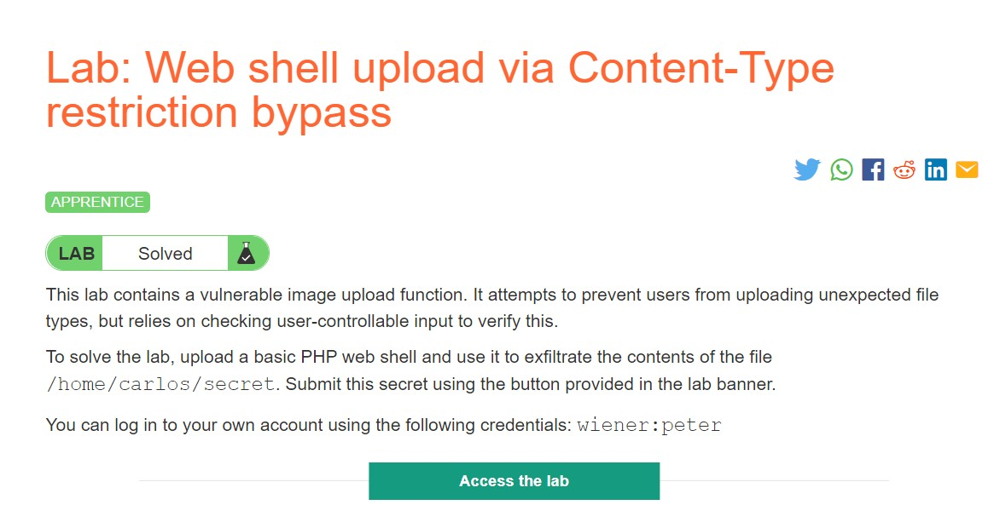
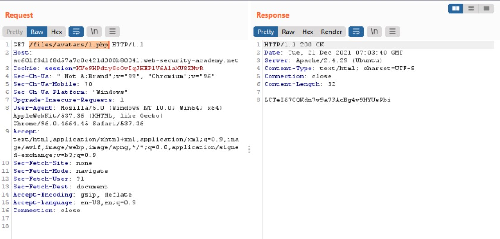
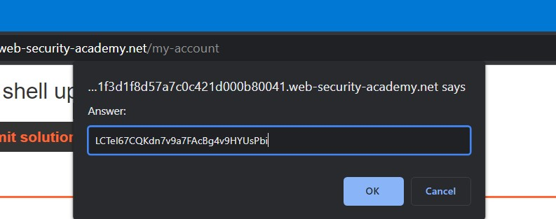

# Lab: Web shell upload via Content-Type restriction bypass

**Link:** [https://portswigger.net/web-security/file-upload/lab-file-upload-web-shell-upload-via-content-type-restriction-bypass](https://portswigger.net/web-security/file-upload/lab-file-upload-web-shell-upload-via-content-type-restriction-bypass)

## Giới thiệu

Với website, khi ta gửi một HTML form lên hệ thống, trình duyệt sẽ gửi đi một yêu cầu POST trong đó chức các thông tin của yêu cầu đó. Thông thường, các trình duyệt gửi đi các yêu cầu với thuộc tính Content-Type là `application/x-www-form-url-encoded`.

Đối với các hệ thống khác nhau, Content-Type được sử dụng các giá trị khác nhau để phù hợp nhất. Bài lab này sẽ yêu cầu ta thực hiện khai thác đánh lừa hệ thống để gửi lên web server một RCE code.

## Phân tích

Tương tự như bài lab ở trên, ta thực hiện login vào hệ thống và thử "test" hệ thống bằng cách tải lên tệp *1.php* mà mình đã sử dụng ở lab trước thì nhận được thông báo:

Như vậy, hệ thống không cho phép ta tải lên các thể loại tệp thuộc về **application/octet-stream** mà chỉ cho tải lên tệp loại **image/jpeg** hoặc **image/png**

## Khai thác

Đến đây, ta sử dụng Burp Repeater để thử đổi Content-Type sang yêu cầu của Lab và gửi lên web server. Mình sẽ sử dụng request bị dính lỗi khi thử upload *1.php* lên hệ thống và đổi lại Content-Type thôi:

Ta thấy, file *1.php* đã được tải lên hệ thống. Bây giờ, ta cần GET tệp này bằng path như ở lab bên trên:

Đến đây, ta đã có được secret của chủ Carlos thân yêu và submit thôi:

Kết quả là chúng ta đã thực hiện khai thác lỗ hổng file upload bằng cách đánh lừa hệ thống khi nó quên xác thực Content-Type của tệp:

