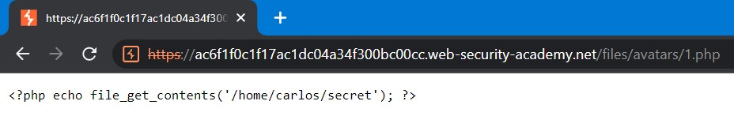
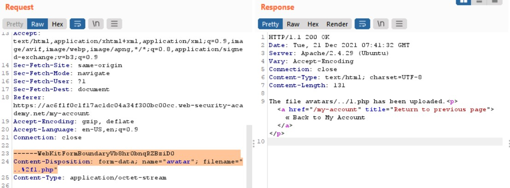
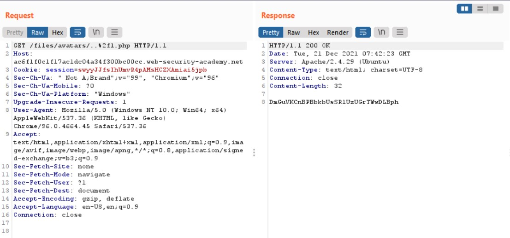
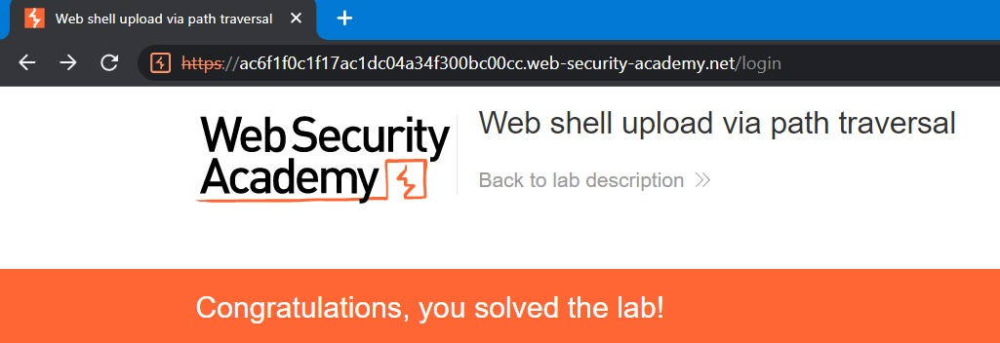

# Lab: Web shell upload via path traversal

**Link:** [https://portswigger.net/web-security/file-upload/lab-file-upload-web-shell-upload-via-path-traversal](https://portswigger.net/web-security/file-upload/lab-file-upload-web-shell-upload-via-path-traversal)

## Giới thiệu

Một trong những cách các website đối phó với lỗ hổng upload file đó chính là chỉ cho phép server thực thi các tệp được cho phép. Nếu các extension của file không nằm trong cấu hình của server, server có thể trả về các thông báo lỗi hoặc nội dung với **Content-Type: text/plain**.

Điều này vô hình chung có thể dẫn đến attacker lợi dụng để soi source code từ server hoặc các tệp riêng tư của server.

Trong bài lab này, tác giả yêu cầu ta thực hiện upload một RCE code lên server và lợi dụng path traversal để có thể leak được secret của chú Carlos

## Phân tích

Tương tự các phần bên trên, trước tiên, ta thử upload đoạn payload của tệp 1.php lên hệ thống:

Ta có thể thấy, server cho phép ta tải tệp lên dù cho nó là .php (có thể thực thi). Nhưng ở lab này, các file này không thể thực thi trong folder của user (một cách ngăn chặn khai thác lỗ hổng upload file) và server trả về nội dung của file ta upload dưới dạng **Content-Type: text/plain** như nãy mình có đề cập.

## Khai thác

Từ đó, ta có thể sử dụng kỹ thuật *directory traversal* để kiểm tra xem các folder khác (folder con hoặc folder cha) có cho phép thực thi hay không (thường thì server sẽ block user thôi hehe). Ở đây, mình sẽ sửa đổi request POST ban nãy mình upload file 1.php lên ở chỗ Content-Disposition từ `filename="1.php"` thành `filename="../1.php"`:

Ohno, có vẻ như không thể upload ra một folder khác bằng cách sử dụng `../`. Ta thử một cách khác đó chính là sử dụng URL encoding đổi `"../"` thành `"..%2f"`:

Như vậy, ta đã upload thành công file 1.php lên một thư mục khác với folder của user. Dùng Burp Suite để request đến `/files/avatars/1.php` để xem bí mật của chú Carlos thôi:

Và submit để hoàn thành bài lab này

