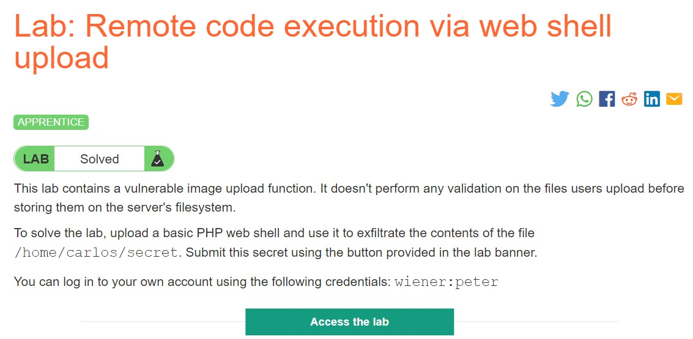
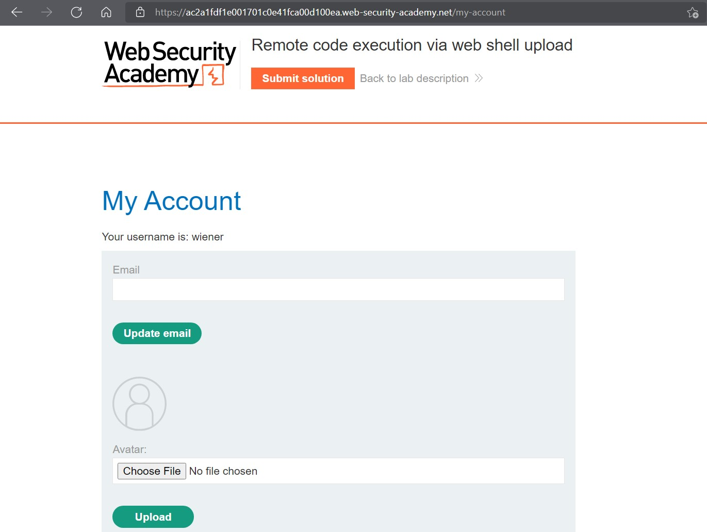
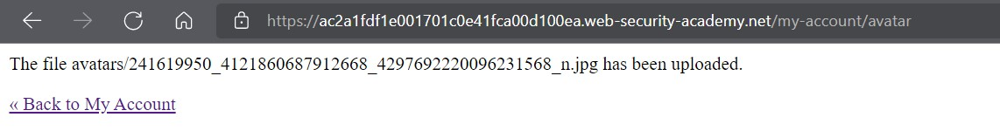
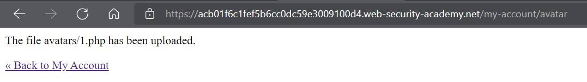
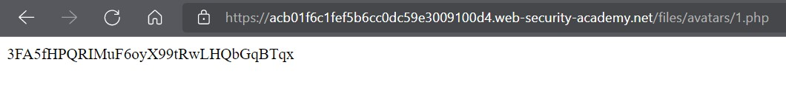
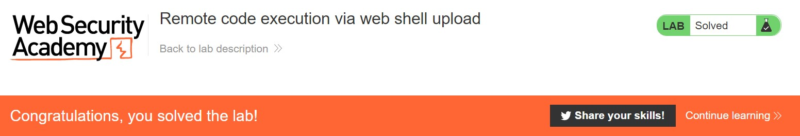

# Lab: Remote code execution via web shell upload

**Link:** [https://portswigger.net/web-security/file-upload/lab-file-upload-remote-code-execution-via-web-shell-upload](https://portswigger.net/web-security/file-upload/lab-file-upload-remote-code-execution-via-web-shell-upload)



## Mục tiêu

Bài lab này yêu cầu mình tải lên một đoạn code RCE để có thể kiểm soát web server hay khai thác tải lên tệp không hạn chế để triển khai web shell

## Giải pháp

Đầu tiên, bật Burp Suite và sử dụng browser của ứng dụng để truy cập vào Lab và thực hiện login bằng tài khoản đã được cung cấp. Vì đây là bài lab liên quan đến upload file nên mình sẽ mò qua phần *My Account* để sử dụng chức năng tải Avatar lên hệ thống.



Sau khi tải thử cái ảnh xàm xí lên hệ thống thì mình nhận được cái thông báo như vầy



Đến đây thì chưa có bất kỳ "clue" nào để mình tiếp tục cả, mò qua HTTP History của chức năng Proxy trong Burp Suite thì ta có thể thấy được các URL mà hệ thống đã thực thi


Như vậy, ta có thể thấy được hệ thống cho phép ta tải lên hình ảnh. Hình ảnh này sẽ được lưu trữ tại `/files/avatars/{tên-tệp}`

## Khai thác

Theo như đề bài, *secret* được cất giữ tại `/home/carlos/secret` và web server sử dụng ngôn ngữ PHP. Do đó, mình sẽ sử dụng một RCE payload code để có thể "reveal" bí mật của chú Carlos và lưu lại với cái tên mỹ miều là *1.php* =)))

```php
<?php echo file_get_contents('/home/carlos/secret'); ?>
```

Sau đó, ta tiến hành tải tệp này lên hệ thống: 


Và cũng nhận được thông báo là tệp chứa RCE đã tải lên thành công:



Thử truy cập vào nơi cất giữ các hình ảnh avatar của hệ thống thì ta được hệ thống trả về một string có vẻ như là bí mật của chú Carlos:



Submit bài lab với string vừa tiềm được thì ta đã thành công thực hiện upload một RCE code lên hệ thống PHP khi web server không xác thực "loại tệp" mà người dùng tải lên hệ thống:


