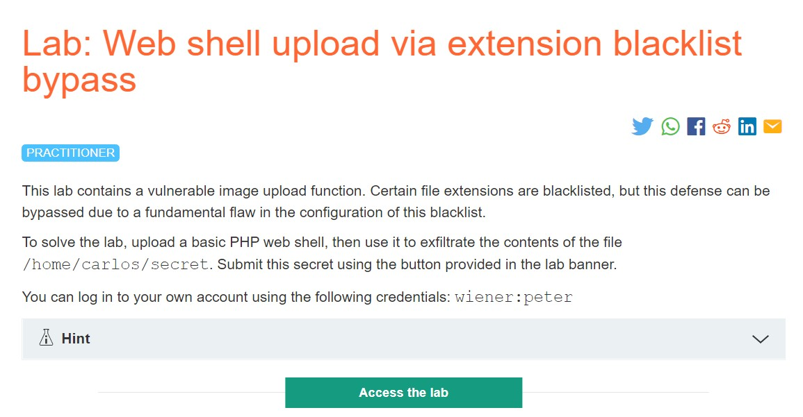
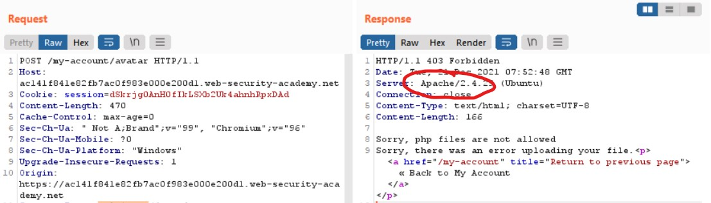
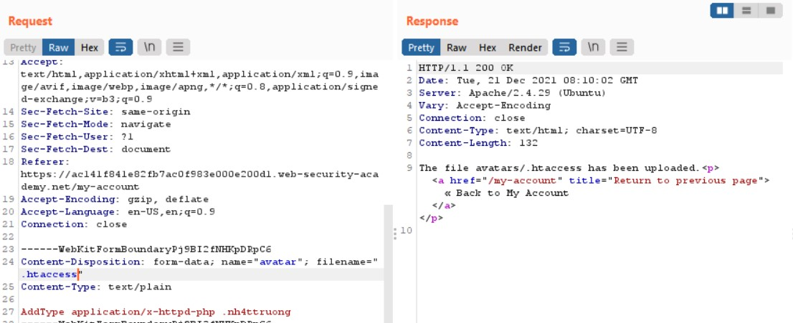
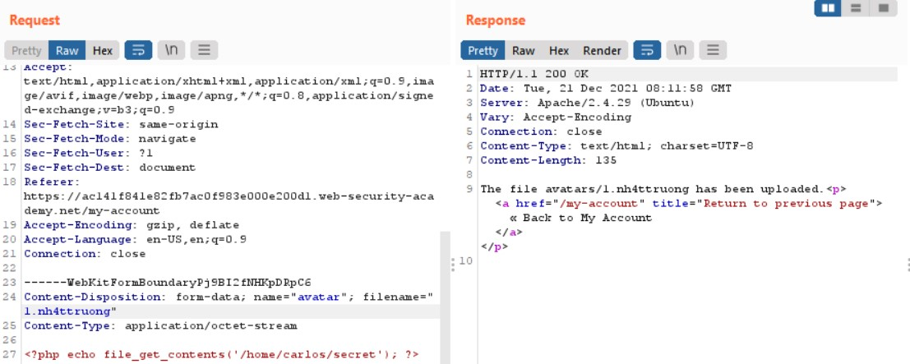
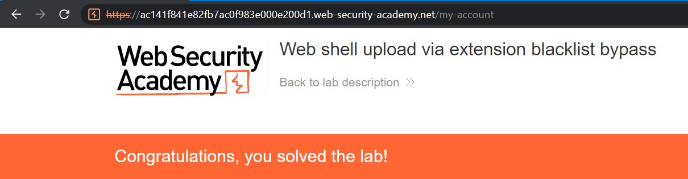

# Lab: Web shell upload via extension blacklist bypass

**Link:** [https://portswigger.net/web-security/file-upload/lab-file-upload-web-shell-upload-via-extension-blacklist-bypass](https://portswigger.net/web-security/file-upload/lab-file-upload-web-shell-upload-via-extension-blacklist-bypass)

## Giới thiệu

Trong các phần trên, mình đã có đề cập đến việc sử dụng blacklist để block các loại tệp nguy hiểm. Tuy vậy, các web server vẫn có thể mắc phải các lỗi như cấu hình thiếu chặt chẽ, quản lý file hời hợt khiến attacker có thể dễ dàng "ghi đè" lên tệp cấu hình của server hoặc bypass được blacklist.

Với Apache, server có thể thực thi một tệp PHP theo request và ông dev ổng có thể thêm những cấu hình như cho phép load module nào hoặc thêm các file extension nào lên tệp config (apache2.conf). Bên cạnh đó, nhiều server còn cho phép ông dev upload ghi đè tệp hoặc thêm content vào tệp config. Ví dụ như trong Apache server, nó cho phép load lên một tệp cấu hình cụ thể cho server nếu như trên apache server tồn tại tệp `.htaccess`.

Trong bài lab này, tác giả yêu cầu ta thực hiện bypass blacklist extension.

## Phân tích

Đầu tiên, mình sẽ thử POST file 1.php lên server:

Kết quả trả về Burp Suite cho thấy, server sử dụng Apache2 và file của mình không lên upload lên vì server chặn tệp .php.

## Khai thác

Như mình có đề cập, các dev có thể linh hoạt thêm vào tệp config (đối với Apache server) các loại tệp sẽ được "cho phép" thực thi trên server. Trong `htaccess`, mấy ông dev chỉ cần thêm dòng `AddType application/x-httpd-php {.extension_cần_thêm}`, server sẽ tự override nó vào `/etc/apache2/apache2.conf`. Lợi dụng điều này, ta sẽ sử dụng Burp Repeater để gửi đi 1 POST mới và gắn cái dòng AddType ở bên trên vào filename .htaccess:

Ta đã thành công gửi file .htaccess lên server. Trong request đó, bạn có thể thấy mình đã gửi request POST và thêm extension mới là .nh4ttruong vào .htaccess (tệp config). Bây giờ, ta thử POST 1 request mới lên server với extension mới:

Thành công rồi hehe, file đã lên được server, việc của ta bậy giờ là GET lại file đó thể thực thi nó:

Và submit bí mật của chú ấy thôi:

