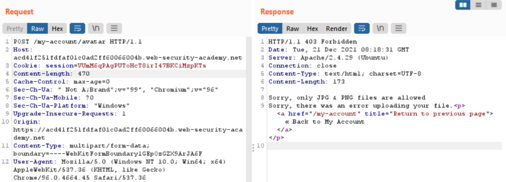
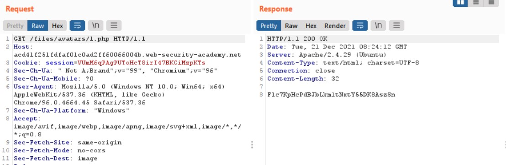
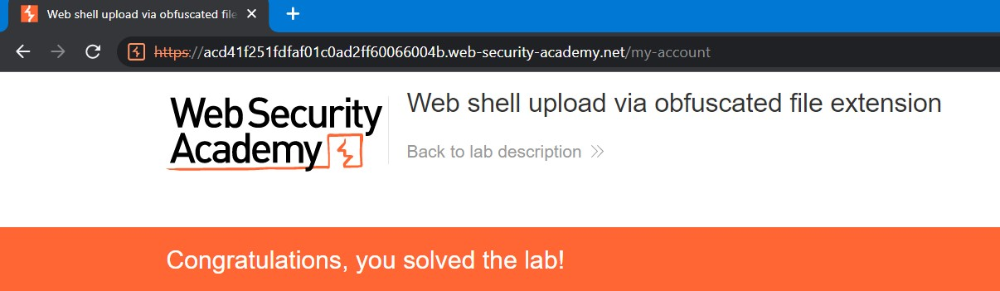

# Lab: Web shell upload via obfuscated file extension

**Link:** [https://portswigger.net/web-security/file-upload/lab-file-upload-web-shell-upload-via-obfuscated-file-extension](https://portswigger.net/web-security/file-upload/lab-file-upload-web-shell-upload-via-obfuscated-file-extension)

## Giới thiệu

Ở bài lab này, tác giả sẽ yêu cầu ta bypass blacklist các extension của file.

## Phân tích

Thử upload 1.php như các lab khác lên server:

Thông báo trả về là ta chỉ có thể upload các extension về hình ảnh (JPG/PNG). Một trong 7749 cách bypass blacklist tiếp theo mình có thể sử dụng đó chính là bypass extension của file với việc sử dụng các trường hợp **case sensitive** để đánh lừa bộ xác thực của website.

## Khai thác

Ký tự `NULL` hay `%00` là một trong những ký tự đặc biệt sẽ có thể khiến bộ xác thực hiểu rằng sau nó không còn gì cả và ta thử bằng cách chèn nó vào như sau:

Như đã thấy, file 1.php đã upload thành công lên server. Và tương tự như các lab trên, GET bí mật và submit thôi

