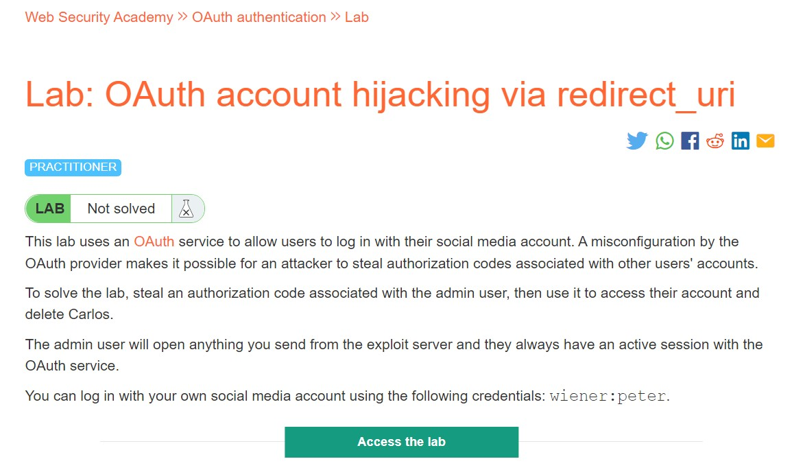
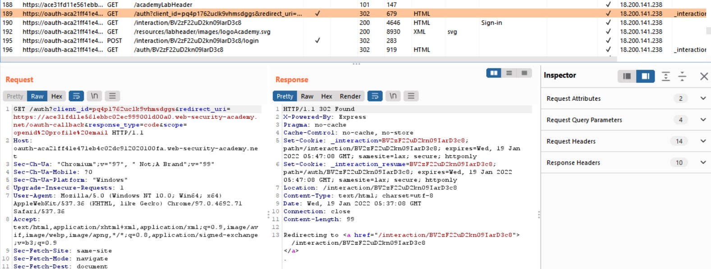
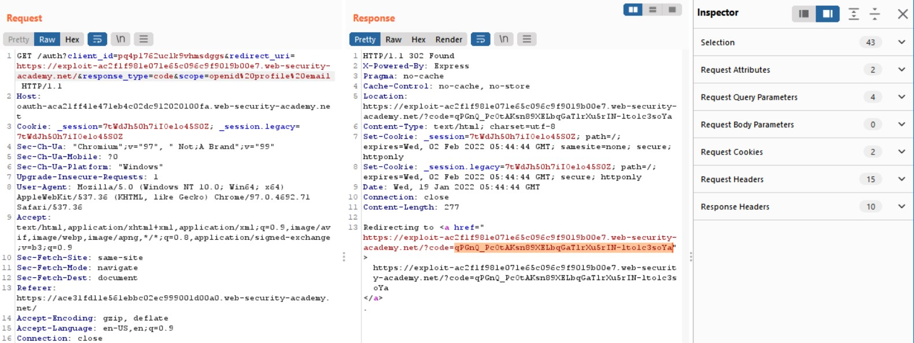
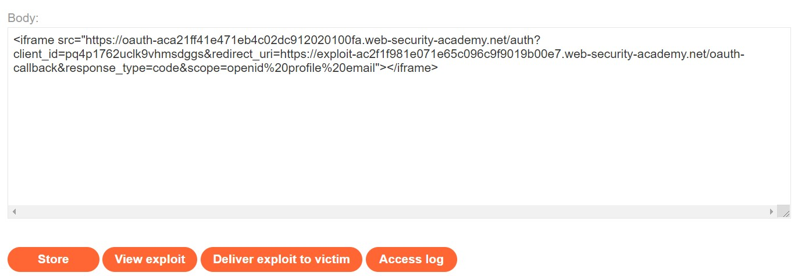
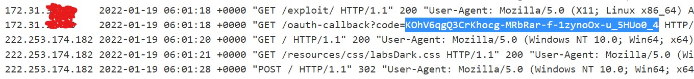
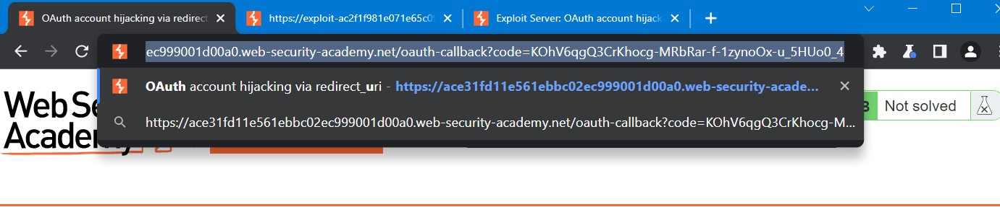
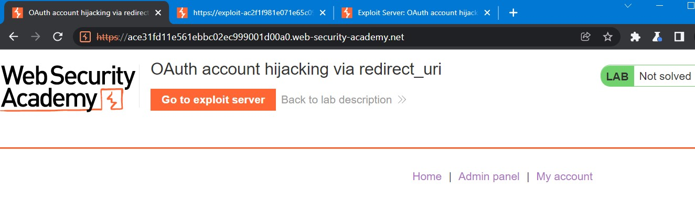
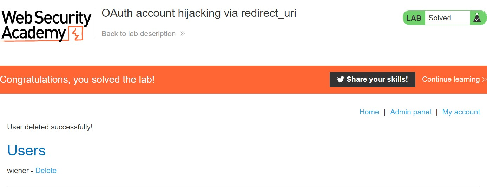

# Lab: OAuth account hijacking via redirect_uri

**Link:** [https://portswigger.net/web-security/oauth/lab-oauth-account-hijacking-via-redirect-uri](https://portswigger.net/web-security/oauth/lab-oauth-account-hijacking-via-redirect-uri)

## Phân tích

Đầu tiên, mình sẽ "go around" website với quy trình login. Mở Burp check History Proxy, ta có thể thấy được request yêu cầu xác thực **/auth?client_id=...**:

Sau đó, ta send nó sang Burp Repeater để tiện theo dõi quá trình "login" của nó. Ở đây, với tham số **redirect_uri**, ta có thể thử điều chỉnh nó đến exploit server để xem có gì xảy ra:

Sau khi send request, ta tiếp tục Follow Redirect thì nhận được một redirect url với một dòng code như bên trên. Như vậy, có thể thấy với tham số redirect-uri mà không kiểm tra thì ta có thể dễ dàng redirect đến bất cứ đâu ta muốn như trong trường hợp này thì đã lừa được server gọi callback send code về cho ta.

## Khai thác

Tương tự, ta sẽ sử dụng Exploit Server để tiến hành exploit challenge. Mình sẽ send một request đến **/exploit** với body là một iframe:

Sau khi Store và Deliver Code đến nạn nhân, kiểm tra Access log thì ta có được một request với leak-code:

Sử dụng browser để truy cập đến URL đó, ta sẽ vào được Admin Panel:

Và thế là ta đã vào được Admin Panel, tiến hành xóa chú Carlos thì đã giải được challenge:

