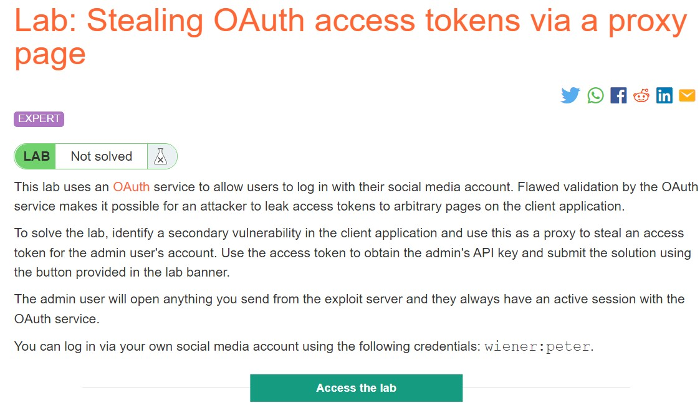
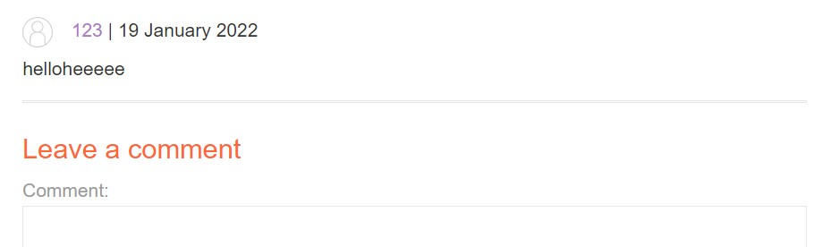
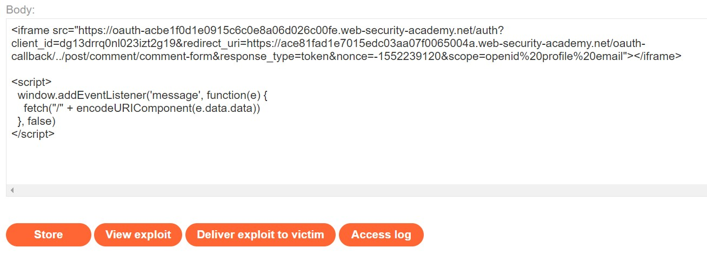
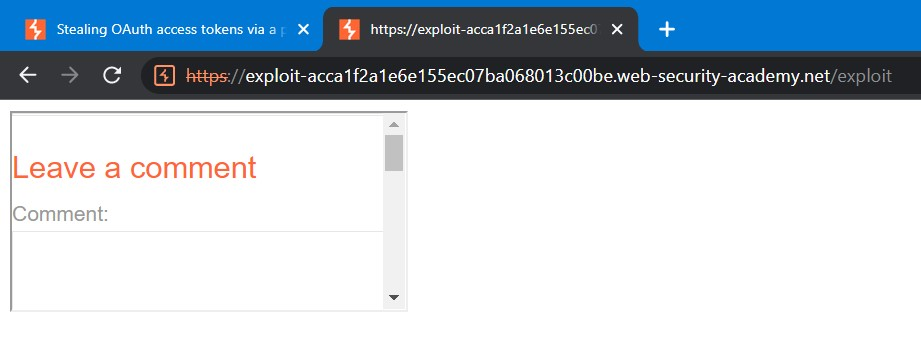
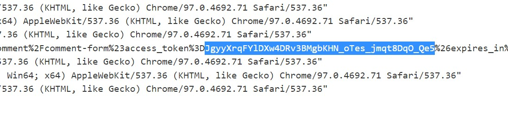
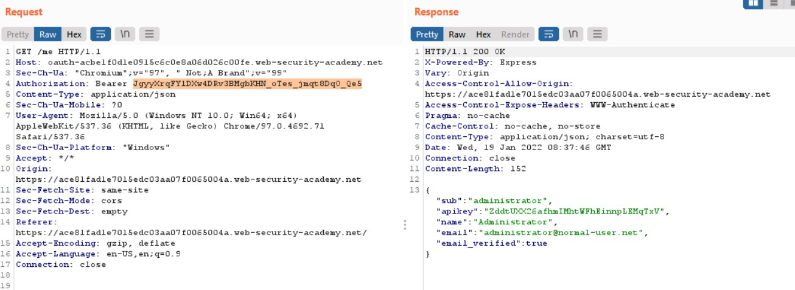
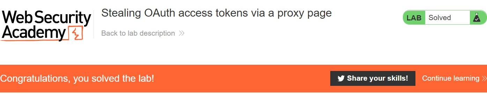

# Lab: Stealing OAuth access tokens via a proxy page

**Link:** [https://portswigger.net/web-security/oauth/lab-oauth-stealing-oauth-access-tokens-via-a-proxy-page](https://portswigger.net/web-security/oauth/lab-oauth-stealing-oauth-access-tokens-via-a-proxy-page)

## Phân tích

Bài này cũng khá giống với bài bên trên, audit website thì ta có thể thấy ở mỗi post đều có chức năng bình luận và bình luận cái gì cũng được:

Đến đây, sau khi tham khảo payload, mình đã thử sử dụng payload như sau:

Store và View Exploit thì thấy ta đã có một iframe comment như lab:

## Khai thác

Đến đây coi như xong, ta Delivery exploit code sau đó check log để get token:

Send token bằng request **/me**:

Như vậy, ta đã có được API của administrator, submit thôi:

