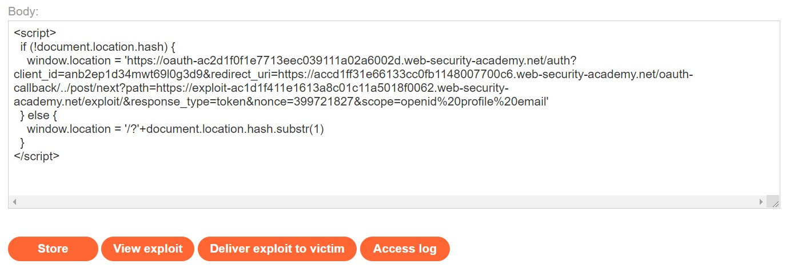
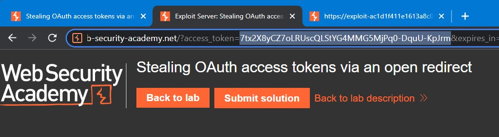
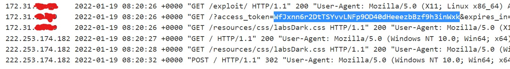
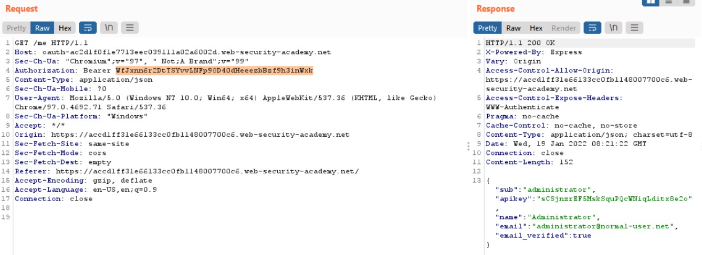

# Lab: Stealing OAuth access tokens via an open redirect

**Link:** [https://portswigger.net/web-security/oauth/lab-OAuth-stealing-redirect-oauth-access-tokens-via-an-open-redirect](https://portswigger.net/web-security/oauth/lab-OAuth-stealing-redirect-oauth-access-tokens-via-an-open-redirect)

## Giới thiệu

Thử thay đổi URI như các phần bên trên thì kết quả cho thấy, server không chiều theo ý ta nữa rồi. Ở lab này, tác giả có đề cập đến 1 phương pháp đó chính là Path Traversal và ta sẽ sử dụng chúng.

## Khai thác

Ở server exploit, ta sẽ thử send đến server đoạn payload như dưới đây để buộc server gửi về cho ta access token:

Sau khi Store, ta sử dụng View Exploit xem payload đã gửi chưa:

Như ta thấy, một access token đã được đính kèm trên URL như vậy có nghĩa là token này đã bị leaked khi ta sử dụng payload.

Quay lại Proxy History, ta thấy với request **/me**, server sẽ trả về cho ta một cái gọi là apikey. Để trả về đúng API key, server sẽ xác thực với **Authorization** cùng token:

Ta sẽ Delivery code exploit với payload ở trên để leak 1 token mới. Kiểm tra log sẽ thấy token như sau:

Đến lúc này ta thay đổi token và send nó thì sẽ nhận được API key cần tìm của administrator:

Và lúc này chỉ cần submit challenge thôi:

