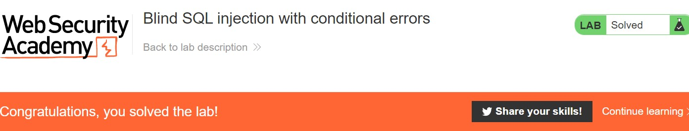

# Lab: Blind SQL injection with conditional errors

**Lab URL:** [PortSwigger Lab](https://portswigger.net/web-security/blind/lab-conditional-errors)

## Mô tả

Lab này cũng khá giống với bài conditonal response. Đại khái, nếu bài lab trước ta có thể dựa vào phản hồi "Welcome back!" để suy luận ra đúng ký tự password thì ở lab này, ta sẽ phải dựa vào lỗi phản hồi để có thể suy luận. Vì vậy, mình sẽ làm nhanh hehe:

## Khai thác

Xác định database:

Xác định độ dài password (length=20):

Kết quả bruteforce:

Password sau khi ghép lại: `i1xcr4zruhfc78onms06`.

## Kết quả

Và solved challenge:

