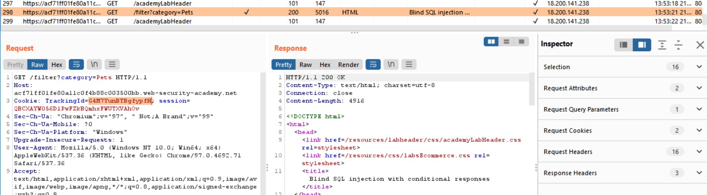
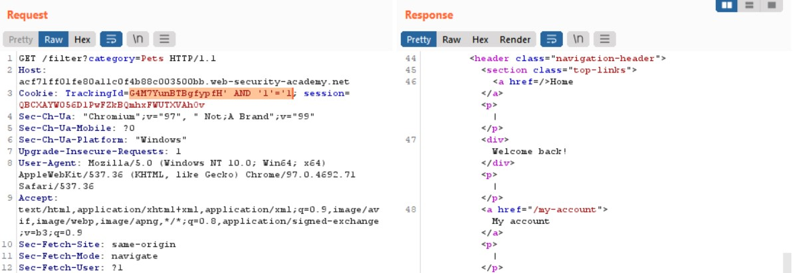
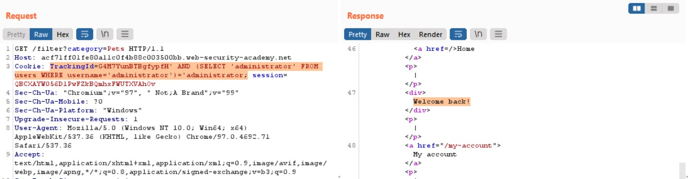
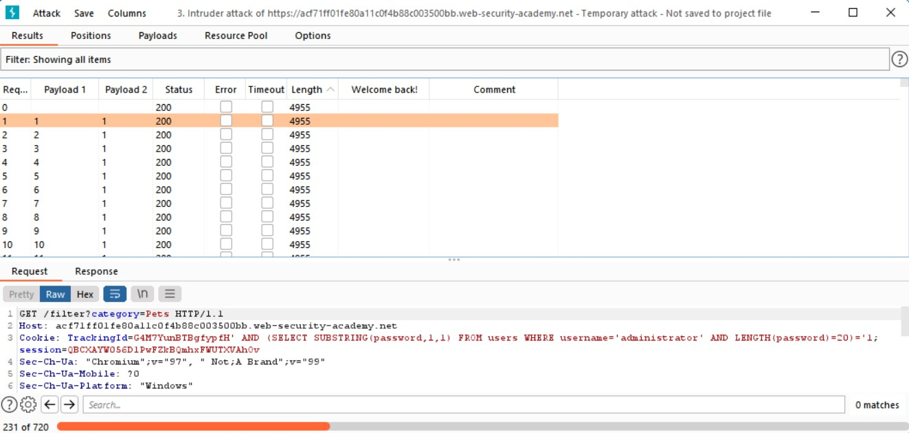

# Lab: Blind SQL injection with conditional responses

**Lab URL:** [PortSwigger Lab](https://portswigger.net/web-security/blind/lab-conditional-responses)

## Mô tả

Bài lab này được thiết kế để ta attack bằng phương pháp Blind SQLi. Nó chứa một cái gọi là tracking cookie để phân tích và kiểm soát cookie người dùng. *Bên cạnh đó, khi query thì không gì được trả về nếu điều kiện sai hoặc lỗi ngoại trừ khi mình query đúng thì nó sẽ trả về chuỗi "Welcome back"*. Bên cạnh đó, nó chứa một bảng users với 2 cột là username và password. Lab yêu cầu ta chiếm quyền kiểm soát administrator.

## Phân tích

Mở Burp lên và kiểm tra request khi filter category thì mình sẽ thấy một tham số là TrackingId.

Bây giờ, mình sẽ thử test điều kiền khi lồng toán tử vào chỗ này:

Như vậy, có thể thấy, mình sẽ có thể Blind SQLi ở đây để dò ra thông tin cần tìm (password). Giờ thì mình sẽ thử dò thử xem có account với username là "administrator" hay không:

Tada, website chứa account admin đó rồi (cái này lab cũng có đề cập nhưng mà mình kiếm thử). Giờ thì đến công đoạn tìm password. Trước tiên, mình sẽ dùng **LENGTH()** để kiểm tra xem password có độ dài bao nhiêu. Sau khi dò với operator **>** và **<** một lúc thì mình đã xác định được `LENGTH(password)=20`:

## Khai thác

Đến đây, mình sẽ phải dò từng ký tự trong password (20 lần) để có thể ghép lại thành password cần tìm với payload:

`Payload: "TrackingId=G4M7YunBTBgfypfH' AND (SELECT SUBSTRING(password,{vi-tri-do},1) FROM users WHERE username='administrator' AND LENGTH(password)=20)='{ky-tu-can-do}"`

Mình đã biết rằng, khi điều kiện SQL đúng thì website sẽ trả về string "Welcome back!", do vậy, mình sẽ brute-force nó bằng Burp Intruder. Sau đây là một vài setting trước khi brute-force:

- Chỉnh chế độ về Cluster-bomb để có thể tùy chỉnh vị trí payload brute-force
- Thêm khóa vào vị trí cần brute-force với nút "Add $". Khóa đầu tiên mình để là vị trí trong password (1-20) và khóa thứ hai là ký tự trong password.

- Tạo danh sách các ký tự có thể có trong password (a-Z, 0-9) cho lần lượt 2 khóa như ảnh trên.

- Tạo điều kiện trả về khi tìm đúng ký tự với điều kiện là "Welcome back!"

- Click "Start attack" và chờ thôi

Sau 2 - 3 tiếng bruteforce, mình đã có được những kết quả trả về match với "Welcome back!". Công việc giờ là sắp xếp lại thành một chuỗi theo thứ tự thôi:

Chuỗi password mà mình đã sắp xếp: `Password: 3n2xxm4cprzjuiim5hpi`

## Kết quả

Submit và solved challenge rồi nè:

