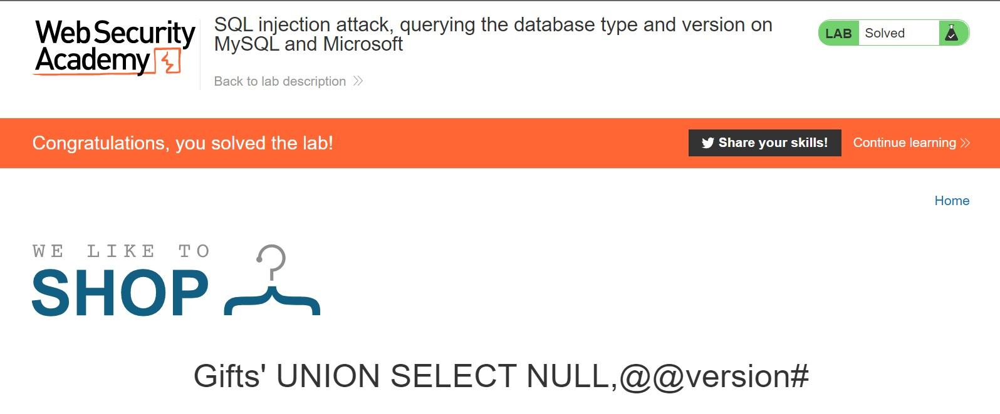

# Lab: SQL injection attack, querying the database type and version on MySQL and Microsoft

**Lab URL:** [PortSwigger Lab](https://portswigger.net/web-security/examining-the-database/lab-querying-database-version-mysql-microsoft)

## Mô tả

Lab này tương tự Lab về Oracle database ở trên nhưng lần này là với Microsoft và MySQL database.

## Phân tích

Database lần này cũng gồm 2 cột sau khi thử:

`Payload: "Gifts' UNION SELECT NULL,NULL#"`

Tuy vậy, lúc đầu mình thử ký tự "#" thì server báo lỗi. Hên sao mình nhớ đến HTML Encoding và chuyển nó thành "%23" thì oke.

## Khai thác

`Payload: "Gifts' UNION SELECT NULL,@@version#"`

## Kết quả

