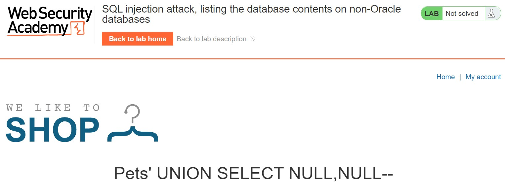
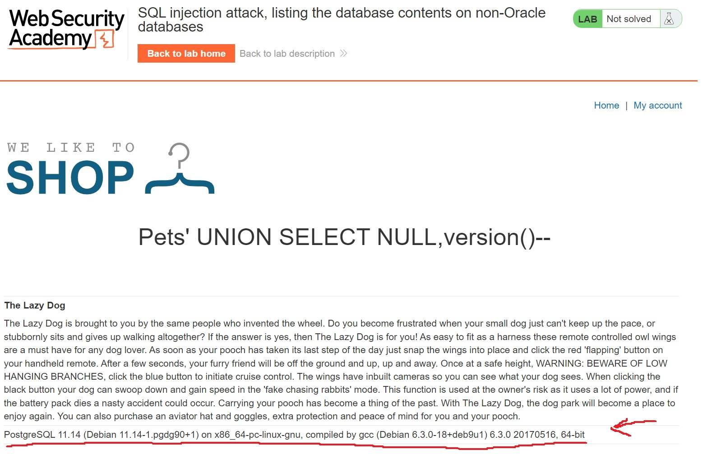
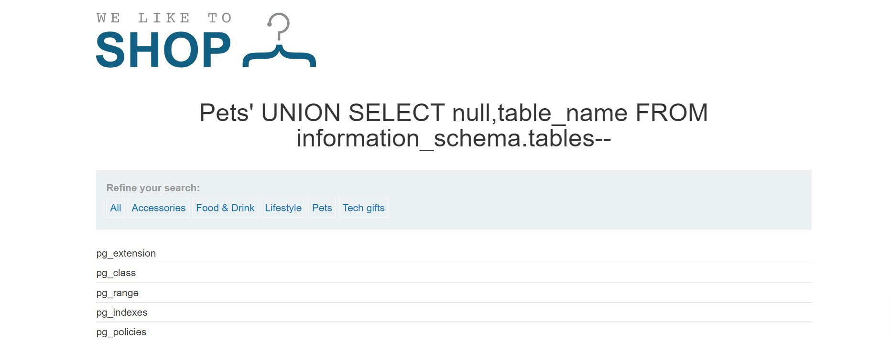
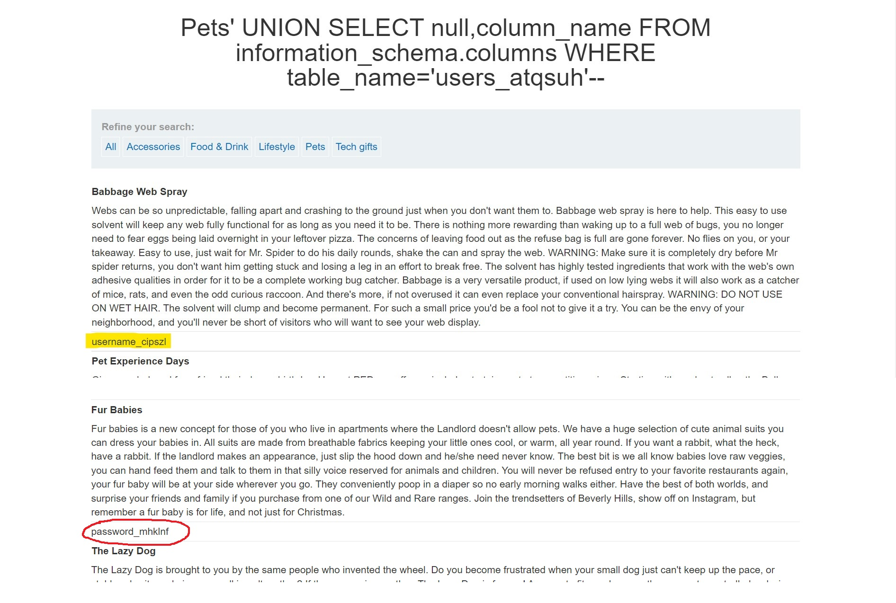
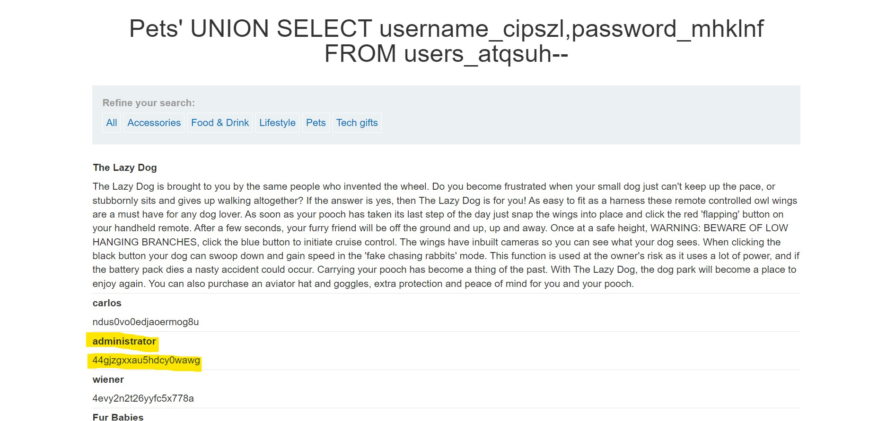

# Lab: SQL injection attack, listing the database contents on non-Oracle databases

**Lab URL:** [PortSwigger Lab](https://portswigger.net/web-security/examining-the-database/lab-listing-database-contents-non-oracle)

## Mô tả

Lab này yêu cầu ta tìm kiếm account của admin để login. Tuy vậy, ta chưa biết database loại nào mà chỉ biết nó không phải là Oracle mà thôi.

## Phân tích

Đầu tiên, mình sẽ dò số cột trong database:

Ta thấy, có 2 cột trong database này. Tiếp tục, mình sẽ dò version của database này:

`Payload: "Pets' UNION SELECT NULL,version()--"`

Đến đây, ta đã biết nó là PostgreSQL 11.14. Ta sẽ sử dụng query `SELECT null,table_name FROM information_schema.tables` để show các bảng trong database này.

Trong các bảng, có 2 bảng có thể chứa thông tin tài khoản của các user đó chính là *users_atqsuh* và *pg_user*. Mình sẽ chọn cái đầu tiên để đi sâu xem có gì trong đó, nếu không có thì quay lại thoiii :v. Trước tiên, mình sẽ cần show các cột trong bảng *users_atqsuh*:

`Payload: "Pets' UNION SELECT null,column_name FROM information_schema.columns WHERE table_name='users_atqsuh'--"`

Đến đây, mình đã biết được rằng thông tin tài khoản và mật khẩu sẽ được lưu vào 2 cột đó chính là *username_cipszl* và *password_mhklnf*.

## Khai thác

Giờ thì query nó ra thôi:

## Kết quả

Có tài khoản xong thì login và solved:

