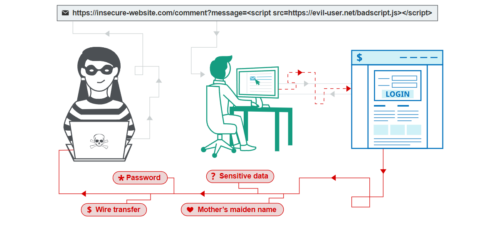

# Cross-site Scripting (XSS)

## Lỗ hổng Cross-site Scripting (XSS)

Cross-site scripting (XSS) là lỗ hổng cho phép attacker tương tác, phá phách ứng dụng web để có thể đánh lừa, phá vỡ các chính sách của website, tiến hành trích xuất dữ liệu người dùng, leo thang đặc quyền... bằng các đoạn script được truyền vào các tham số, các chức năng của website.

Thông thường, để kiểm tra xem website có dính XSS hay không thì người ta thường dùng *alert()* để gọi website cảnh báo. Hiện nay, người ta dùng thêm *print()* để check XSS vuln.

## Các loại XSS

XSS có rất nhiều loại, người ta gom nó thành 3 loại chính:
- **Reflected XSS**: Truyền malicious script vào HTTP request.
- **Stored XSS**: Liên quan đến Web database khi những malicious script có thể được attacker truyền vào các chức năng của website để tấn công.
- **DOM-based XSS**: Liên quan đến lỗ hổng từ phía Client khi xử lý dữ liệu từ các input trên website.

Để hiểu rõ hơn về XSS thì chúng ta sẽ bắt đầu các LAB về lỗ hổng này ^^

## Reflected XSS

Khi một website có chức năng search và filter với URL như sau: `https://insecure-website.com/search?term=gift`. Nếu website dính Reflected XSS, attacker có thể lợi dụng để tấn công bằng cách truyền vào `term` parameter dạng: `https://insecure-website.com/search?term=`. Điều này có nghĩa, attacker có thể thực hiện nhiều cách thức khác để tiến hành phá hoại hoặc tấn công website.

### HTML Context Labs

- [Reflected XSS with nothing encoded](./reflected-xss/html-context-nothing-encoded.md)
- [Reflected XSS with most tags and attributes blocked](./reflected-xss/html-context-tags-blocked.md)
- [Reflected XSS with all tags blocked except custom ones](./reflected-xss/html-context-custom-tags.md)
- [Reflected XSS with event handlers and href blocked](./reflected-xss/event-handlers-href-blocked.md)
- [Reflected XSS with some SVG markup allowed](./reflected-xss/svg-markup-allowed.md)
- [Reflected XSS with angle brackets HTML-encoded](./reflected-xss/angle-brackets-encoded.md)
- [Reflected XSS in canonical link tag](./reflected-xss/canonical-link-tag.md)

### JavaScript Context Labs

- [Reflected XSS with single quote and backslash escaped](./reflected-xss/js-single-quote-escaped.md)
- [Reflected XSS with angle brackets encoded](./reflected-xss/js-angle-brackets-encoded.md)
- [Reflected XSS with all encoded and escaped](./reflected-xss/js-all-encoded-escaped.md)

## Stored XSS

[Mình sẽ ghi chép lại LAB phần này tại đây ^^](./stored-xss/readme.md)

(Spoiler: Phần này đang "stored" trong đầu tác giả, chưa "XSS" ra ngoài được 😂)

## DOM-based XSS

*Coming soon... (thực sự là "coming soon" chứ không phải "coming never" đâu nhé!)*
