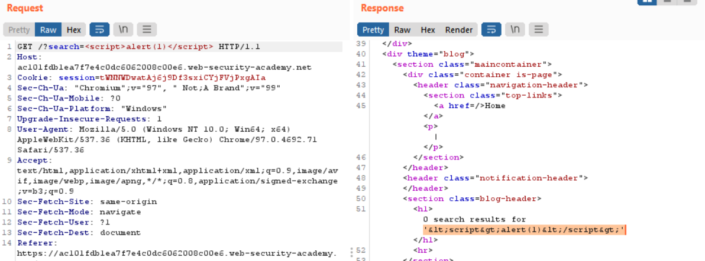
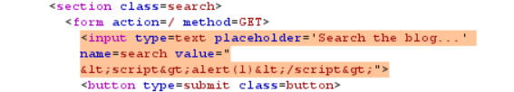
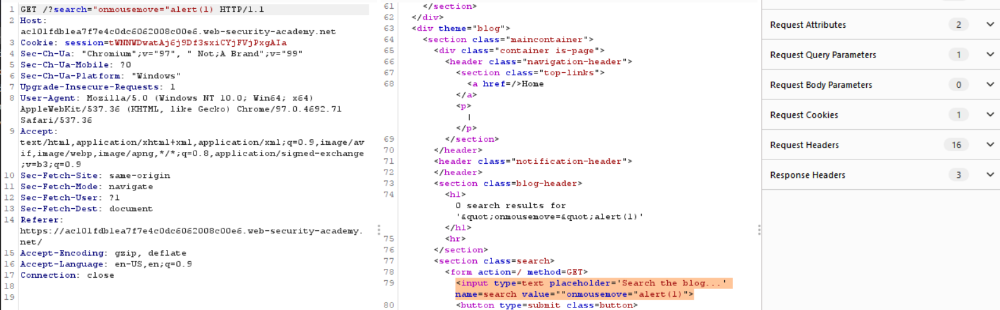

# Lab: Reflected XSS into attribute with angle brackets HTML-encoded

**Lab URL:** [PortSwigger Lab](https://portswigger.net/web-security/cross-site-scripting/contexts/lab-attribute-angle-brackets-html-encoded)

## Mô tả

Lab yêu cầu ta khiến website la lên bằng "alert()".

## Phân tích

Đầu tiên, ta test thử với ``:

Ta có thể thấy, dấu '<' bị mã hóa thành '&lt;' và dấu '>' bị mã hóa thành '&gt;'. Do vậy, script sẽ không thể chạy, giờ thì tìm cách khác.

Theo như hình trên, mọi người có thể thấy, thẻ input có thuộc tích values chứa nội dung mà ta search và được ngăn nhau bởi '"'. Bây giờ, ý tưởng là sẽ thực hiện thêm event handler vào và trigger nó thôi.

## Khai thác

Mình đã thêm `"onmousemove="alert(1)` vào để biến nó thành `...values=""onmousemove="alert(1)"` để trigger khi di chuyển chuột thì sẽ chạy alert(1).

## Kết quả

Và thế là solved!

