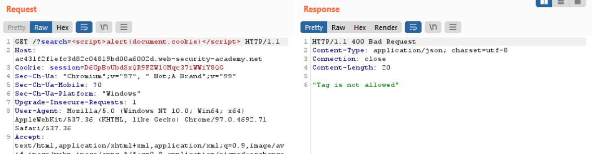

# Lab: Reflected XSS into HTML context with all tags blocked except custom ones

**Lab URL:** [PortSwigger Lab](https://portswigger.net/web-security/cross-site-scripting/contexts/lab-html-context-with-all-standard-tags-blocked)

## Mô tả

Bài Lab này cũng tương tự như phần chặn hầu hết các tags và attribute, tuy vậy nó sẽ cho ta sử dụng custom tags. Lab yêu cầu ta thực hiện alert ra *document.cookie*.

## Phân tích

Vì nó đã block hết tags nên ta không thể truyền script vào được:

## Khai thác

Thế thì ta chỉ cần custom cái tag lại và Delivery đến lab:

`Payload: `

Dùng `onfocus` để trigger đến alert, dùng #x để trỏ ngay đến id của tag.

## Kết quả

