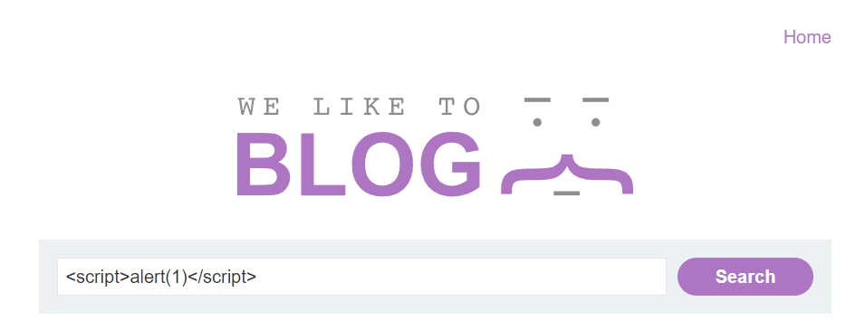
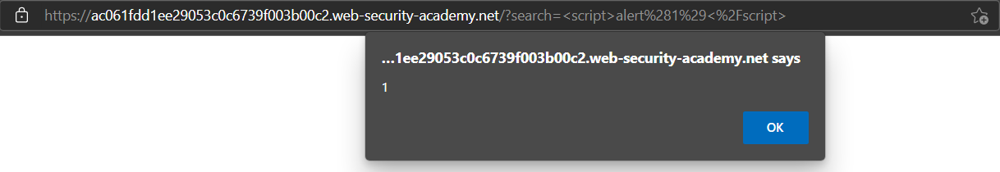

# Lab: Reflected XSS into HTML context with nothing encoded

**Lab URL:** [PortSwigger Lab](https://portswigger.net/web-security/cross-site-scripting/reflected/lab-html-context-nothing-encoded)

## Mô tả

Lab này là bài đầu tiên trong chủ đề Reflected XSS. Công việc của mình là khiến website la lên thông qua hàm *alert()*.

## Khai thác

Mở Lab thì mình sẽ thấy ngay một ô *Search* và ngại gì nữa mà không thử ``

Ngay sau đó, website đã la lên "1" rồi nè =)))

## Kết quả

Như vậy, ta có thể thấy khi chức năng Search không được chăm sóc kỹ thì sẽ dẫn đến XSS. Ở Lab này, tác giả đã không mã hóa nội dung khi mình gửi request lên server. Vậy là ta đã solved rồi :3

