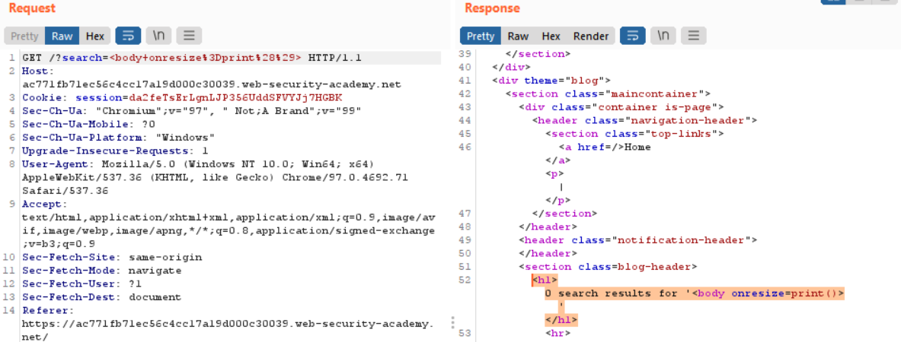

# Lab: Reflected XSS into HTML context with most tags and attributes blocked

**Lab URL:** [PortSwigger Lab](https://portswigger.net/web-security/cross-site-scripting/contexts/lab-html-context-with-most-tags-and-attributes-blocked)

## Mô tả

Bài này yêu cầu ta thực hiện bypass qua WAF và gọi được hàm *print()*.

## Phân tích

Về tổng thể, bài này có giao diện tương tự như Lab trước. Như tên bài Lab, nó sẽ chặn các thẻ và thuộc tính nhất định khi ta truyền XSS script vào.

Mình đã thử vài thẻ nhưng không bypass được. Do vậy, mình sẽ dùng Burp Intruder để bruteforce tìm ra whitelist:

Mọi người có thể thấy, `body` được whitelist trong lab này. Công đoạn tiếp theo là mình sẽ phải tìm attribute được whitelist. Vì nó sẽ bị block như vầy:

Mình có biết sơ về XSS nên đã thử vài option như: `onerror`, `onload`,... nhưng không được, may sao `onresize` lại bypass được:

## Khai thác

Giờ thì vào Exploit Server và gắn payload `<body onresize=print()>` vào để exploit thôi:

`Payload: <iframe src="https://ac771fb71ec56c4cc17a19d000c30039.web-security-academy.net/?search=<body%20onresize=print()>" onload=this.style.width='100px'>`

Note: Ban đầu mình không gắn `onload` vào iframe nên nó không load được cái src của mình nên cần phải gắn attribute vô iframe.

## Kết quả

Vậy là solved rồi:

