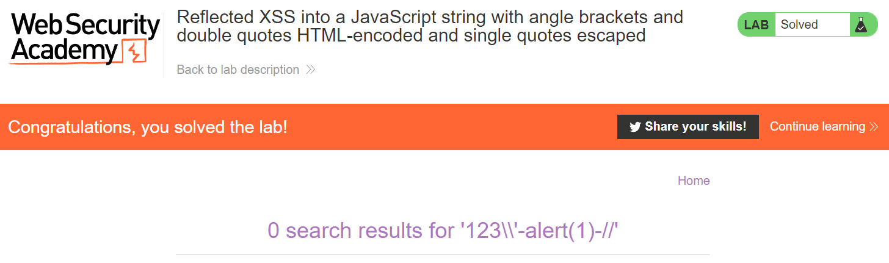

# Lab: Reflected XSS into a JavaScript string with angle brackets and double quotes HTML-encoded and single quotes escaped

**Lab URL:** [PortSwigger Lab](https://portswigger.net/web-security/cross-site-scripting/contexts/lab-javascript-string-angle-brackets-double-quotes-encoded-single-quotes-escaped)

## Mô tả

Độ khó tăng dần, đây là sự kết hợp của 2 bài lab phía trên. Với bài này, ta cần bypass HTML-encoded và escaped.

## Khai thác

Payload: `123\'-alert(1)-//`

Mình dùng `\'` để kết thúc escaped đầu tiên, tiếp theo dùng `-` để bypass HTML-encoded và tương tự với `//` để bypass escaped cuối.

## Kết quả

