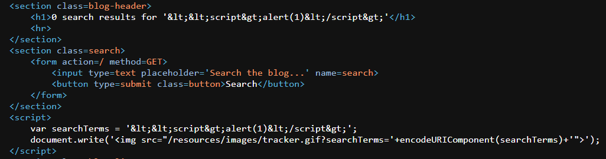
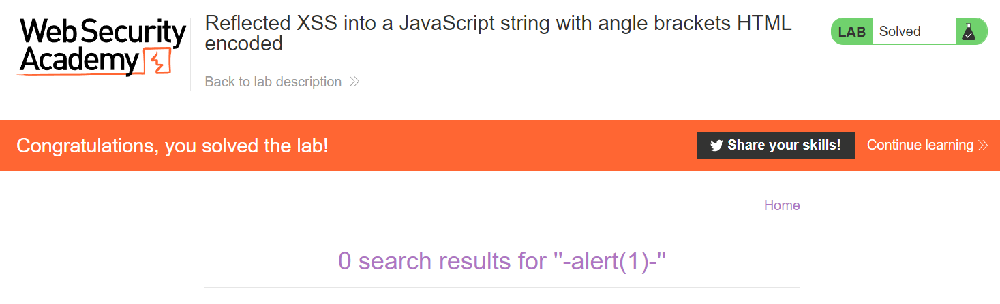

# Lab: Reflected XSS into a JavaScript string with angle brackets encoded

**Lab URL:** [PortSwigger Lab](https://portswigger.net/web-security/cross-site-scripting/contexts/lab-javascript-string-angle-brackets-html-encoded)

## Mô tả

Khi ta thực hiện bypass với payload `</script>`, các dấu "<", ">" đều bị mã hóa thành "&lt;" và "&gt;".

## Phân tích

Do vậy, ta không thể chèn thẻ đóng vào được mà cần phải làm cho Javascript thoát khỏi chuỗi hiện tại và thực thi lệnh của ta.

## Khai thác

Payload: `'-alert(1)-'`

## Kết quả

