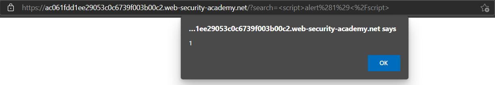
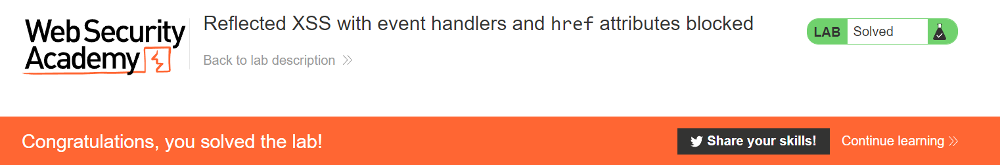

# LAB - Relected XSS

Khi một website có chức năng search và filter với URL như sau: `https://insecure-website.com/search?term=gift`. Nếu website dính Relflected XSS, attacker có thể lợi dụng để tấn công bằng cách truyền vào `term` parameter dạng: `https://insecure-website.com/search?term=<script>alert("Hehe website is hacked")</script>`. Điều này có nghĩa, attacker có thể thực hiện nhiều cách thức khác để tiến hành phá hoại hoặc tấn công website.

Mình sẽ ghi chú lại những bài LAB về chủ đề *Reflected XSS* tại đây.

*MỤC LỤC:*
- [Reflected XSS khi HTML website không sử dụng encode](#html-context-nothing-encoded)
- [Reflected XSS khi website chặn hầu hết các thẻ HTML](#html-context-tags-and-attributes-blocked)
- [Reflected XSS khi website chặn hết các thẻ HTML, chỉ cho phép thẻ custom](#html-context-custom-tags-allowed)
- [Reflected XSS khi event handlers và href bị chặn](#event-handlers-and-href-attributes-blocked)
- [Reflected XSS với thẻ SVG](#svg-markup-allowed)
- [Reflected XSS khi các dấu '<', '>' bị mã hóa](#angle-brackets-html-encoded)
- [Reflected XSS bằng thẻ link](#canonical-link-tag)
- [Reflected Javascript single quote và blackslash escaped bypass](#js-single-quote)
- [Reflected Javascript mã hóa dấu ngoặc nhọn](#js-angle-brackets)
- [Reflected JavaScript mã hóa dấu ngoặc nhọn, dấu nháy kép và escaped dấu nháy đơn](#js-block-angle-brackets-double-quotes-single-quote-escaped")

### Lab: Reflected XSS into HTML context with nothing encoded <a name="html-context-nothing-encoded"></a>

Đường dẫn đến lab: https://portswigger.net/web-security/cross-site-scripting/reflected/lab-html-context-nothing-encoded

Lab này là bài đầu tiên trong chủ đề Reflected XSS. Công việc của mình là khiến website la lên thông qua hàm *alert()*. Mở Lab thì mình sẽ thấy ngay một ô *Search* và ngại gì nữa mà không thử `<script>alert(1)</script>`


Ngay sau đó, website đã la lên "1" rồi nè =)))



Như vậy, ta có thể thấy khi chức năng Search không được chăm sóc kỹ thì sẽ dẫn đến XSS. Ở Lab này, tác giả đã không mã hóa nội dung khi mình gửi request lên server. Vậy là ta đã solved rồi :3


### Lab: Reflected XSS into HTML context with most tags and attributes blocked <a name="html-context-tags-and-attributes-blocked"></a>

Đường dẫn đến lab: https://portswigger.net/web-security/cross-site-scripting/contexts/lab-html-context-with-most-tags-and-attributes-blocked

Bài này yêu cầu ta thực hiện bypass qua WAF và gọi được hàm *print()*.

Về tổng thể, bài này có giao diện tương tự như [Lab trước](#html-context-nothing-encoded). Như tên bài Lab, nó sẽ chặn các thẻ và thuộc tính nhất định khi ta truyền XSS script vào.


Mình đã thử vài thẻ nhưng không bypass được. Do vậy, mình sẽ dùng Burp Intruder để bruteforce tìm ra whitelist:


Mọi người có thể thấy, `body` được whitelist trong lab này. Công đoạn tiếp theo là mình sẽ phải tìm attribute được whitelist. Vì nó sẽ bị block như vầy:


Mình có biết sơ về XSS nên đã thử vài option như: `onerror`, `onload`,... nhưng không được, may sao `onresize` lại bypass được:


Giờ thì vào Exploit Server và gắn payload `<body onresize=print()>` vào để exploit thôi:

`Payload: <iframe src="https://ac771fb71ec56c4cc17a19d000c30039.web-security-academy.net/?search=<body%20onresize=print()>" onload=this.style.width='100px'>`

Note: Ban đầu mình không gắn `onload` vào iframe nên nó không load được cái src của mình nên cần phải gắn attribute vô iframe.

Vậy là solved rồi:


### Lab: Reflected XSS into HTML context with all tags blocked except custom ones <a name="html-context-custom-tags-allowed"></a>

Đường dẫn đến lab: https://portswigger.net/web-security/cross-site-scripting/contexts/lab-html-context-with-all-standard-tags-blocked

Bài Lab này cũng tương tự như phần chặn hầu hết các tags và attribute, tuy vậy nó sẽ cho ta sử dụng custom tags. Lab yêu cầu ta thực hiện alert ra *document.cookie*. Vì nó đã block hết tags nên ta không thể truyền script vào được:


Thế thì ta chỉ cần custom cái tag lại và Delivery đến lab:
`Payload: <script> location='https://ac431f2f1efc3d82c04819bd00a6002d.web-security-academy.net/?search=<nh4ttruong+id=x+onfocus=alert(document.cookie)+tabindex=1>#x'; </script>`

Dùng `onfocus` để trigger đến alert, dùng #x để trỏ ngay đến id của tag.


### Lab: Reflected XSS with event handlers and href attributes blocked <a name="event-handlers-and-href-attributes-blocked"></a>

Đường dẫn đến lab: https://portswigger.net/web-security/cross-site-scripting/contexts/lab-event-handlers-and-href-attributes-blocked

Bài Lab yêu cầu ta thực hiện Reflected XSS khi các event handlers và href attribute đã bị block. Bên cạnh đó, sử dụng vector để gọi alert. Do vậy, mình sẽ sử dụng [*svg*](https://developer.mozilla.org/en-US/docs/Web/SVG/Element/animate) tag để trigger alert vì nó có thẻ con là `animate` và trong `animate` có thuộc tính *attributeName*, *values* và mình có thể thêm href cũng như script vào tùy ý.

`Payload: https://ace01fe61f679bb0c0a0298b00bc0014.web-security-academy.net/?search=%3Csvg%3E%3Ca%3E%3Canimate+attributeName%3Dhref+values%3Djavascript%3Aalert(1)+%2F%3E%3Ctext+x%3D20+y%3D20%3EClick%3C%2Ftext%3E%3C%2Fa%3E`



### Lab: Reflected XSS with some SVG markup allowed <a name="svg-markup-allowed"></a>

Đường dẫn đến Lab: https://portswigger.net/web-security/cross-site-scripting/contexts/lab-some-svg-markup-allowed

Lab này yêu cầu ta thực hiện gọi alert() và đương nhiên nó sẽ chặn một vài tags. Đến đây, mình thử dùng được tag <svg>. Mình thử qua các child tag của <svg> thì thấy [<animateTransform>](https://developer.mozilla.org/en-US/docs/Web/SVG/Element/animateTransform) không bị block.

Vì lab này không chặn các event handlers, nên mình sẽ cố bắt nó chạy các event handlers. Chuyện có vẻ khá khó khi nó cũng chặn các event handlers. Giờ thì bruteforce thoi.

Sau khi bruteforce, mình thấy `onbegin` được thả, nên dùng nó vào:
`Payload: <svg><animateTransform attributeName=nh4ttruong onbegin=alert(1)></svg>`


Thế là done:


### Lab: Reflected XSS into attribute with angle brackets HTML-encoded <a name="angle-brackets-html-encoded"></a>

Đường dẫn đến Lab: https://portswigger.net/web-security/cross-site-scripting/contexts/lab-attribute-angle-brackets-html-encoded

Lab yêu cầu ta khiến website la lên bằng "alert()". Đầu tiên, ta test thử với `<script>alert(1)</alert>`:


Ta có thể thấy, dấu '<' bị mã hóa thành '&lt;' và dấu '>' bị mã hóa thành '&gt;'. Do vậy, script sẽ không thể chạy, giờ thì tìm cách khác.


Theo như hình trên, mọi người có thể thấy, thẻ input có thuộc tích values chứa nội dung mà ta search và được ngăn nhau bởi '"'. Bây giờ, ý tưởng là sẽ thực hiện thêm event handler vào và trigger nó thôi.


Mình đã thêm `"onmousemove="alert(1)` vào để biến nó thành `...values=""onmousemove="alert(1)"` để trigger khi di chuyển chuột thì sẽ chạy alert(1). Và thế là solved!


### Lab: Reflected XSS in canonical link tag <a name="canonical-link-tag"></a>

Đường dẫn đến lab: https://portswigger.net/web-security/cross-site-scripting/contexts/lab-canonical-link-tag

Bài lab này yêu cầu ta thực hiện trigger với shortcut key để khiến website alert(). Vậy thì chỉ có thể dùng `accesskey` để kêu nó alert thôi:

`Payload: .../?accesskey='x'onclick='alert(1)`

Alert được gọi khi ta nhấn "ALT+SHIFT+X":


Và solved:


### Lab: Reflected XSS into a JavaScript string with single quote and backslash escaped <a name="js-single-quote"></a>

Đường dẫn đến lab: https://portswigger.net/web-security/cross-site-scripting/contexts/lab-javascript-string-single-quote-backslash-escaped

Lab này yêu cầu ta dùng trick để bypass bằng dấu "'" và "/", "\" của website.

Test thử thanh search của Lab và check source code:


Ta thấy, script của website sẽ như sau:
```javascript
<script>
    var searchTerms = '123';
    document.write('');
</script>
```

`encodeURIComponent()` trong Javascript sẽ mã hóa tất cả các ký tự ngoại trừ `- _ . ! ~ * ' ( )`. Do vậy, mình đã thử nhiều cái những vẫn bị encode đưa vào `document.write`.

Nhưng mà, ta có thể chèn `</script>` vô để khóa cái `searchTerms` lại và chèn thêm script tùy ý vào mà đúng không =))))


Payload: `</script><script>alert(1)</script>`

### Lab: Reflected XSS into a JavaScript string with single quote and backslash escaped <a name="js-angle-brackets"></a>

Đường dẫn đến lab: https://portswigger.net/web-security/cross-site-scripting/contexts/lab-javascript-string-angle-brackets-html-encoded

Khi ta thực hiện bypass với payload `</script><script>alert(1)</script>`, các dấu "<", ">" đều bị mã hóa thành "&lt;" và "&gt;".


Do vậy, ta không thể chèn thẻ đóng vào được mà cần phải làm cho Javascript thoát khỏi chuỗi hiện tại và thực thi lệnh của ta với payload `'-alert(1)-'`.


### Lab: Reflected XSS into a JavaScript string with angle brackets and double quotes HTML-encoded and single quotes escaped <a name="js-block-angle-brackets-double-quotes-single-quote-escaped"></a>

Đường dẫn đến lab: https://portswigger.net/web-security/cross-site-scripting/contexts/lab-javascript-string-angle-brackets-double-quotes-encoded-single-quotes-escaped

Độ khó tăng dần, đây là sự kết hợp của 2 bài lab phía trên. Với bài này, ta cần bypass HTML-encoded và escaped.

Payload: `123\'-alert(1)-//`

Mình dùng `\'` để kết thúc escaped đầu tiên, tiếp theo dùng `-` để bypass HTML-encoded và tương tự với `//` để bypass escaped cuối.

