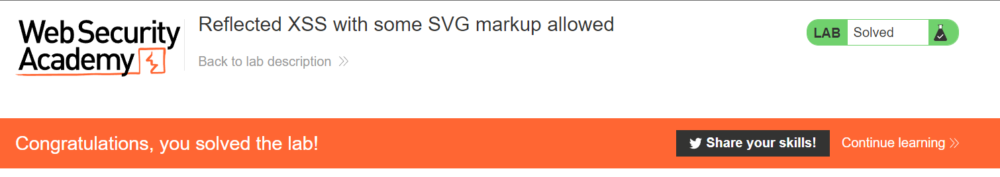

# Lab: Reflected XSS with some SVG markup allowed

**Lab URL:** [PortSwigger Lab](https://portswigger.net/web-security/cross-site-scripting/contexts/lab-some-svg-markup-allowed)

## Mô tả

Lab này yêu cầu ta thực hiện gọi alert() và đương nhiên nó sẽ chặn một vài tags.

## Phân tích

Đến đây, mình thử dùng được tag <svg>. Mình thử qua các child tag của <svg> thì thấy [<animateTransform>](https://developer.mozilla.org/en-US/docs/Web/SVG/Element/animateTransform) không bị block.

Vì lab này không chặn các event handlers, nên mình sẽ cố bắt nó chạy các event handlers. Chuyện có vẻ khá khó khi nó cũng chặn các event handlers. Giờ thì bruteforce thoi.

Sau khi bruteforce, mình thấy `onbegin` được thả, nên dùng nó vào.

## Khai thác

`Payload: <svg><animateTransform attributeName=nh4ttruong onbegin=alert(1)></svg>`

## Kết quả

Thế là done:

